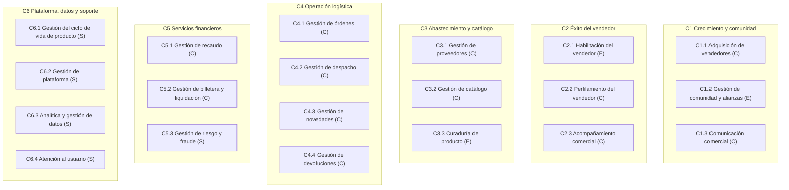
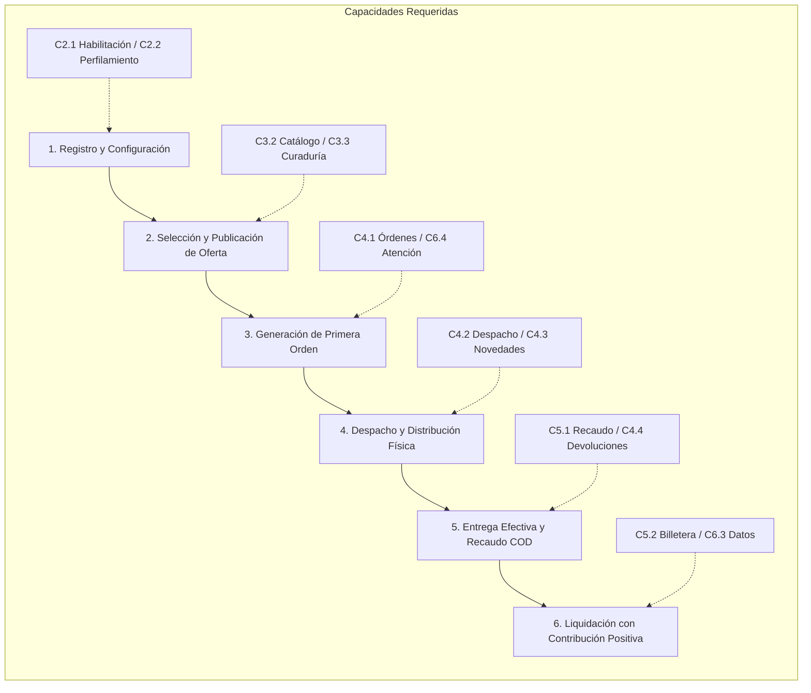
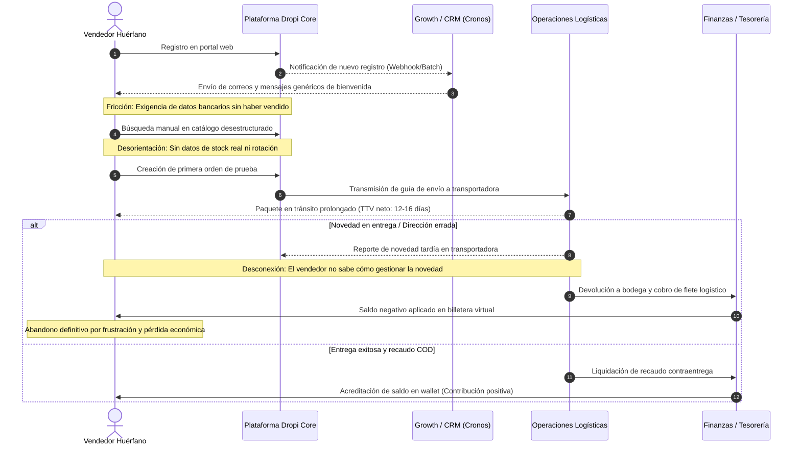

# Arquitectura de negocio de Dropi: habilitación del vendedor sin comunidad
## Informe Maestro de Arquitectura de Negocio y Modelo Operativo (Semana 1)

**Estudiante:** Santiago Herrera Acosta  
**Programa:** Maestría en Estrategia Digital de Negocios / Gestión Estratégica de Procesos (Universidad Icesi)  
**Asignatura:** Arquitectura de Negocios e Hiperautomatización de Procesos (GES-60172)  
**Profesor Titular:** Julio Gómez  
**Fecha de Entrega:** 3 de septiembre de 2026  
**Organización:** Dropi Technologies (Colombia)  
**Rol del Autor en la Organización:** Product Manager en Seller Success  

---

## 1. Contexto de negocio y justificación estratégica

Dropi opera como una plataforma tecnológica de intermediación de comercio electrónico y logística con recaudo contraentrega (Cash On Delivery - COD). El modelo permite comercializar productos sin adquirir inventario propio previo: el proveedor físico o el centro de *fulfillment* almacena y alista el pedido, una transportadora aliada lo distribuye y cobra al destinatario final, y Dropi gestiona la dispersión de fondos. Dropi no cobra membresías fijas ni licencias de software; su monetización proviene de comisiones por intermediación sobre órdenes entregadas y del diferencial logístico (*spread* de flete) pactado con las transportadoras (Dropi, s. f.-b, s. f.-c).

Desde el rol de Product Manager en Seller Success, el problema abordado es la **preparación y habilitación del vendedor sin comunidad ni gestor asignado ("vendedor huérfano")**. Este usuario ingresa por canales digitales o tráfico orgánico y se enfrenta de forma solitaria a la plataforma: debe comprender la dinámica del recaudo contraentrega, seleccionar un producto viable en un catálogo masivo, estimar sus márgenes netos y lanzar pauta publicitaria sin acompañamiento formativo. Esta dificultad compromete la promesa y orientación pública de Dropi de impulsar el crecimiento y éxito de sus emprendedores (Dropi oficial, 2026), demostrando que el registro gratuito y el acceso a herramientas no garantizan la capacidad operativa para transaccionar.

Los antecedentes y auditorías internas de cohortes (abril–junio de 2026, analizadas a agosto de 2026 por el equipo de Analytics bajo el requerimiento PROD-1341) permiten dimensionar la magnitud del problema:
* Se estima que aproximadamente el **40 % de los usuarios registrados carecen de comunidad o mentor externo**, y que cerca del **90 % dentro de este grupo son principiantes absolutos** en comercio digital.
* En el comportamiento general de la plataforma, por cada 100 registros se observan **7,7 primeras órdenes creadas a 90 días (activación bruta)** y solo **4,8 primeras órdenes entregadas con éxito (activación neta)**. En el segmento específico de vendedores sin comunidad, la activación neta apenas alcanza el **5,2 %**, en contraste con el **23 % de activación neta registrado en vendedores que ingresan apadrinados por academias o comunidades privadas**.
* Se constata una pronunciada brecha temporal (latencia de valor): mientras la mediana de tiempo a la primera orden creada (TTV bruto) es de **5,2 a 7,4 días**, la mediana hasta la primera orden efectivamente entregada (TTV neto) se dilata a **12,1 a 16,0 días**. La retención genuina de hábito a 30 días (`sobrevive_30d_otro_dia`) se sitúa en torno al **30 %**.

Para orientar el caso de estudio sin atribuir metas corporativas no aprobadas, se formulan tres objetivos específicos:
* **O1:** Aumentar la proporción de vendedores sin comunidad que completen su primera entrega liquidada con contribución económica positiva.
* **O2:** Reducir el tiempo promedio (TTV neto) y el costo operativo de acompañamiento requerido por cada vendedor activado.
* **O3:** Desarrollar autonomía operativa en el vendedor principiante para que gestione pedidos y seleccione ofertas viables de forma autosuficiente.

El alcance del informe se delimita geográficamente a **Colombia**, abarcando el ciclo de vida desde el **registro del usuario hasta su primera orden entregada y liquidada con contribución marginal positiva**. Contribución positiva significa que el valor cobrado cubre el costo del producto, el flete de la transportadora, la comisión de Dropi y los cargos atribuibles conocidos ($\text{Pv} - \text{Pp} - \text{Flete} - \text{Fee} > 0$); un saldo acreditado bruto en billetera no equivale a ganancia neta. Esta delimitación obliga a evaluar fallas logísticas e incidencias de despacho antes de atribuir el abandono exclusivamente a carencias formativas. La oportunidad radica en estructurar la capacidad de habilitación antes de pretender escalar automatizaciones sobre un proceso que hoy dispersa al usuario.

---

## 2. Mapa de capacidades de negocio

El mapa de capacidades organiza **QUÉ** necesita poder hacer Dropi para ejecutar su modelo de negocio, desacoplando las capacidades de los procesos, las estructuras organizacionales y las herramientas tecnológicas particulares (Amani et al., 2024; Universidad Icesi, s. f.). Se estructura en **seis dominios N1 y veinte capacidades N2** (desarrolladas hasta nivel N3 en el anexo A).

### Figura 1: Mapa de capacidades de Dropi (Nivel 1 y Nivel 2)


*Nota.* Elaboración propia a partir del caso. Clasificación por capacidad N2: **E = Estratégica / Diferenciación planteada**; **C = Core / Misional**; **S = Soporte**.

### Criterios de delimitación y relaciones críticas entre capacidades
1. **Habilitación del vendedor (C2.1):** Agrupa la orientación inicial, la formación comercial y el acompañamiento de la primera venta. Se clasifica como **Estratégica (E)** en el caso porque representa la hipótesis de diferenciación para generar autonomía interna sin depender de academias de terceros. La "activación" se define como el resultado medible de esta capacidad, evitando contar dos veces los beneficios formativos.
2. **Acompañamiento comercial (C2.3) vs. Atención al usuario (C6.4):** Se delimita claramente que C2.3 está reservada para el desarrollo de cuentas de alto volumen (programa de Acompañamiento 360), mientras que C6.4 resuelve consultas técnicas e incidentes de soporte transversal para cualquier usuario.
3. **Curaduría de producto (C3.3):** Clasificada como **Estratégica (E)** porque evalúa la viabilidad comercial y la rotación esperada de la oferta, a diferencia de la mera administración de fichas técnicas en Gestión de catálogo (C3.2 - Core).
4. **Interdependencia de C2.1:** La habilitación no opera en el vacío. Depende de **Curaduría de producto (C3.3)** para guiar al novato hacia inventarios con stock real y baja tasa de devolución, y de **Analítica y gestión de datos (C6.3)** para rastrear eventos de comportamiento y disparar intervenciones oportunas.

---

## 3. Representación del negocio y flujo de valor

El **Business Model Canvas** (desarrollado en el anexo D) sintetiza la lógica económica de Dropi (Strategyzer, s. f.). La propuesta de valor central —permitir comercializar por internet sin comprar stock previo ni contratar logística propia— resuelve la barrera financiera de entrada, pero no la barrera operativa ni cognitiva. Mientras que los vendedores de comunidad acceden a acompañamiento externo, el vendedor que llega de forma independiente cuenta con catálogo y soporte técnico, pero carece de criterio para seleccionar productos ganadores, calcular márgenes netos y mitigar el riesgo del flete en pedidos devueltos. Esta tensión entre **acceso a la plataforma** y **preparación para operar** constituye el núcleo de la oportunidad analizada.

### Figura 2: Flujo de valor del vendedor y capacidades habilitantes


*Nota.* Elaboración propia. Representa la cadena de resultados sucesivos requeridos para materializar valor. No constituye un Value Stream Mapping (VSM) con tiempos de ciclo cronometrados.

### Interpretación del flujo de valor
El flujo de valor evidencia que el avance de una etapa a la siguiente no es lineal ni garantizado:
* Registrarse solo habilita el acceso.
* Publicar una oferta demuestra intención, pero no garantiza competitividad comercial ni stock asegurado en bodega.
* Generar la primera orden manual o integrada (hito de activación bruta) inicia la operación logística, pero no asegura la entrega.
* Una orden devuelta por dirección incompleta o rechazo del comprador en puerta (COD) destruye el valor generado, cargando el costo del flete al usuario y precipitando su abandono definitivo.

Por esta razón, se adopta como resultado terminal del proceso la **primera entrega liquidada con contribución económica positiva**, utilizando la primera orden únicamente como un indicador de avance intermedio.

---

## 4. Modelo operativo actual y stakeholders

En la operación actual ("As-Is"), la atención al vendedor huérfano se encuentra desarticulada entre silos funcionales:
* **Seller Success:** Diseña la experiencia de usuario y recorridos en producto, pero carece de visibilidad integrada de eventos de comportamiento en tiempo real.
* **Growth / CRM:** Dispara comunicaciones genéricas por correo electrónico o mensajes de WhatsApp basados en registros de Cronos, y adelanta pruebas aisladas de llamadas automatizadas con agentes de voz sin coordinación estrecha con la célula de producto.
* **Logística:** Monitorea transportadoras y gestiona novedades de entrega cuando el paquete ya está en ruta, de forma reactiva.
* **Finanzas / Tesorería:** Concilia los recaudos transferidos por las transportadoras y liquida fletes en la billetera de forma agregada.

### Figura 3: Modelo operativo actual (transferencias e interrupciones)



### Figura 4: Stakeholders priorizados por poder e interés en la habilitación

| Nivel de Interés \ Poder | Bajo Poder Formal sobre Recursos | Alto Poder Formal y Decisión |
| :--- | :--- | :--- |
| **Alto Interés en Habilitación** | **Vendedores Huérfanos:** Usuarios que experimentan el dolor directo; tienen bajo poder formal pero deben validar la experiencia.<br>**Líderes de Formación / Célula Seller Success:** Diseñan el acompañamiento y buscan reducir el abandono. | **Liderazgo de Producto (PM) y Tecnología:** Tienen el mandato y la capacidad técnica para modificar flujos, integrar datos y desplegar soluciones.<br>**Equipo Growth / CRM:** Controla los canales de comunicación y disparadores automatizados. |
| **Bajo Interés en Habilitación** *(Alto en Entrega)* | **Compradores Finales:** Les interesa recibir el producto a tiempo, no cómo se formó el vendedor.<br>**Empresas Transportadoras:** Les interesa la eficiencia de ruta y el recaudo COD en calle, no el proceso de inducción del seller. | **Dirección Financiera (CFO / Tesorería):** Exige control de saldo y prevención de deuda; interviene estableciendo límites de riesgo.<br>**Comité Directivo / CPO:** Supervisa la meta global de órdenes (7.8M) y autoriza inversiones estructurales. |

---

## 5. Diagnóstico de madurez y priorización

La evaluación de madurez del dominio de **Habilitación del Vendedor** se realiza bajo la escala de 1 a 5 (1 = Inicial, 2 = Repetible, 3 = Definido, 4 = Gestionado, 5 = Optimizado), fundamentando positivamente el nivel alcanzado y señalando la condición que falta para avanzar (Universidad Icesi, s. f.).

### Tabla 1: Madurez del dominio de habilitación y evidencia observable

| Dimensión | Nivel | Evidencia Interna que Acredita el Nivel Asignado | Condición Faltante para Avanzar al Siguiente Nivel |
| :--- | :---: | :--- | :--- |
| **Procesos** | **2 (Repetible)** | Existen prácticas repetidas de inducción: creación de tutoriales en Academy, flujos de bienvenida en UserPilot y guías comerciales elaboradas por el equipo de producto. | **Falta estandarización y gobierno formal:** No existe un mapa del proceso documentado, no hay un dueño funcional unificado entre Producto, Growth y Soporte, y la definición de "activación" difiere entre áreas. |
| **Digital** | **2 (Repetible)** | Se cuenta con plataformas digitales operativas (portal web, app móvil, panel de administración, herramientas de analítica y CRM como Intercom/Cronos). | **Falta integración e interoperabilidad:** La información de órdenes, navegación y estados de catálogo está fragmentada en bases de datos desconectadas; Producto carece de acceso unificado a eventos de comportamiento. |
| **Automatización** | **2 (Repetible)** | Operan automatizaciones aisladas e insulares: envíos programados de secuencias de correo, mensajes automáticos por WhatsApp y llamadas de voz con IA en Growth. | **Falta orquestación transversal guiada por eventos:** Las reglas de negocio operan desconectadas de la plataforma core; el copiloto de asistencia se encuentra en concepción y no existen disparadores basados en el ciclo de vida del usuario. |

### Matriz Valor vs. Esfuerzo y Justificación de la Brecha Priorizada

Se evaluaron ocho brechas organizacionales identificadas a lo largo de la cadena de valor (detalle completo en el anexo C):
* **B1:** Carencia de un proceso unificado de habilitación operativa para vendedores sin comunidad (Capacidad C2.1) — **Valor: 5 / Esfuerzo: 4**.
* **B2:** Falta de perfilamiento conductual en el momento del registro (Capacidad C2.2) — **Valor: 4 / Esfuerzo: 2**.
* **B3:** Ausencia de curaduría de catálogo para ofertas de entrada (Capacidad C3.3) — **Valor: 4 / Esfuerzo: 2**.
* **B4:** Desconexión en el acompañamiento y rescate de novedades logísticas (Capacidad C4.3) — **Valor: 4 / Esfuerzo: 4**.
* **B5:** Desarticulación de contenidos de formación comercial básica (Capacidad C2.1.2) — **Valor: 4 / Esfuerzo: 3**.
* **B6:** Carencia de instrumentación y accesibilidad de datos analíticos (Capacidad C6.3) — **Valor: 5 / Esfuerzo: 4**.
* **B7:** Desconexión en la atención a consultas operativas de soporte (Capacidad C6.4) — **Valor: 2 / Esfuerzo: 2**.
* **B8:** Ineficiencia en la coordinación de devoluciones de producto (Capacidad C4.4) — **Valor: 2 / Esfuerzo: 4**.

```
Valor
  ▲
5 │                  [B6]            ★ [B1] (PROCESO SELECCIONADO)
  │
4 │         [B2]     [B3]   [B5]     [B4]
  │
3 │
  │
2 │         [B7]                     [B8]
  │
1 └──────────┬────────┬───────┬───────┬────────► Esfuerzo
             1        2       3       4        5
```

### Decisión Justificada de Selección
Se selecciona la **Brecha B1 (Proceso de Habilitación del Vendedor sin Comunidad)** como el objeto central de transformación para los siguientes entregables del semestre. 

**Justificación:**
1. **Conexión directa con los objetivos estratégicos:** B1 ataca la causa raíz de la fuga de activación neta (5,2 %), impactando directamente en O1 (vendedores con contribución positiva), O2 (reducción de costo de acompañamiento) y O3 (autonomía del seller).
2. **Nexo estructural:** Las brechas B2 (perfilamiento), B3 (curaduría) y B5 (formación) son intervenciones que se integran de forma natural como componentes dentro de B1. A su vez, B6 (datos) representa una dependencia habilitante que se resolverá progresivamente.
3. **Coherencia metodológica:** Siguiendo las directrices del curso, B1 representa un proyecto de **transformación estratégica de procesos** que debe ser rediseñado y estandarizado conceptualmente en la Semana 2 (AS-IS vs. TO-BE), antes de seleccionar y desplegar tecnologías de hiperautomatización en las Semanas 3 y 4.

---

## Referencias

* Amani, E., Bajer, A., Bata, T., Dugan, L., Fenge, K., Hooyman, B., Schlamann, H., Ulrich, W., & Wienke, P. (2024). *The business architecture metamodel guide* (V3.0). Business Architecture Guild. https://cdn.ymaws.com/www.businessarchitectureguild.org/resource/resmgr/whitepapers/business_architecture_metamo.pdf
* Dropi. (s. f.-a). *Dropi Colombia: Dropshipping y logística ecommerce*. Recuperado el 2 de septiembre de 2026, de https://dropi.co/
* Dropi. (s. f.-b). *Fulfillment*. Recuperado el 2 de septiembre de 2026, de https://dropi.co/fulfillment
* Dropi. (s. f.-c). *Términos y condiciones – DROPI S.A.S.* Recuperado el 2 de septiembre de 2026, de https://dropi.co/legal/terminos-y-condiciones/
* Dropi oficial. (2026, 7 de julio). *El crecimiento se construye con estrategia, consistencia y ejecución* [Publicación]. LinkedIn. https://es.linkedin.com/posts/dropioficial_dropshipping-ecommerce-comercioelectronico-activity-7480322934444732416-jMts
* Strategyzer. (s. f.). *The business model canvas*. https://www.strategyzer.com/library/the-business-model-canvas
* Universidad Icesi. (s. f.). *Clase 1: Arquitectura de negocio y capacidades empresariales* [Material didáctico en HTML]. Asignatura GES-60172, Maestría en Estrategia Digital de Negocios.

---

## Anexo A: Mapa de capacidades N1–N3 y criterios de clasificación

La asignación de categorías se realiza a nivel N2 bajo los lineamientos de Amani et al. (2024) y Universidad Icesi (s. f.):
* **Estratégica (E):** Capacidades que materializan una propuesta de diferenciación competitiva planteada por el caso (comunidad, habilitación autónoma y curaduría de oferta). No representan ventajas consolidadas, sino apuestas estratégicas a validar.
* **Core / Misional (C):** Capacidades indispensables para procesar la transacción y ejecutar la cadena de valor del comercio electrónico contraentrega.
* **Soporte (S):** Capacidades transversales de infraestructura, control, analítica o atención general que habilitan la operación sin ser exclusivas de la promesa de valor al seller.

### Tabla A1: Capacidades comerciales, de abastecimiento y del vendedor

| Dominio N1 | Capacidad N2 | Subcapacidades N3 | Cat. | Fundamento de Clasificación |
| :--- | :--- | :--- | :---: | :--- |
| **C1 Crecimiento y comunidad** | **C1.1 Adquisición de vendedores** | C1.1.1 Captación digital<br>C1.1.2 Gestión de canales de referidos | **C** | Indispensable para nutrir el embudo de usuarios de la plataforma. |
| | **C1.2 Gestión de comunidad y alianzas** | C1.2.1 Relación con formadores y academias<br>C1.2.2 Desarrollo de alianzas comerciales | **E** | Apuesta diferenciadora que conecta la formación externa con el volumen transaccional de Dropi. |
| | **C1.3 Comunicación comercial** | C1.3.1 Segmentación de comunicaciones<br>C1.3.2 Difusión multicanal de campañas | **C** | Canal de contacto recurrente para promocionar novedades operativas. |
| **C2 Éxito del vendedor** | **C2.1 Habilitación del vendedor** | C2.1.1 Orientación inicial contextual<br>C2.1.2 Formación comercial básica<br>C2.1.3 Acompañamiento de primera venta | **E** | Núcleo de la transformación propuesta: desarrollar autonomía sin depender de mentores externos. |
| | **C2.2 Perfilamiento del vendedor** | C2.2.1 Caracterización socioeconómica<br>C2.2.2 Segmentación conductual de entrada | **C** | Clasificación operacional para enrutar al usuario según experiencia previa. |
| | **C2.3 Acompañamiento comercial** | C2.3.1 Desarrollo de cuentas clave<br>C2.3.2 Atención comercial de alto volumen | **C** | Gestión especializada reservada a los 250 clientes Pareto (Acompañamiento 360). |
| **C3 Abastecimiento y catálogo** | **C3.1 Gestión de proveedores** | C3.1.1 Vinculación y validación de proveedores<br>C3.1.2 Evaluación de cumplimiento y SLA | **C** | Sostiene la relación y el acuerdo de nivel de servicio con los dueños de stock. |
| | **C3.2 Gestión de catálogo** | C3.2.1 Administración de fichas de producto<br>C3.2.2 Control de precios y disponibilidad | **C** | Mantenimiento administrativo del repositorio de productos. |
| | **C3.3 Curaduría de producto** | C3.3.1 Análisis predictivo de demanda<br>C3.3.2 Evaluación de viabilidad de margen | **E** | Apuesta diferenciadora para filtrar y sugerir productos ganadores con stock confiable. |

### Tabla A2: Capacidades logísticas, financieras y de plataforma

| Dominio N1 | Capacidad N2 | Subcapacidades N3 | Cat. | Fundamento de Clasificación |
| :--- | :--- | :--- | :---: | :--- |
| **C4 Operación logística** | **C4.1 Gestión de órdenes** | C4.1.1 Captura y validación de pedidos<br>C4.1.2 Enrutamiento automático de órdenes | **C** | Procesa el flujo transaccional central de la plataforma. |
| | **C4.2 Gestión de despacho** | C4.2.1 Alistamiento y empaque en bodega<br>C4.2.2 Asignación y entrega a transportadora | **C** | Ejecución física del envío contraentrega. |
| | **C4.3 Gestión de novedades** | C4.3.1 Diagnóstico de incidencias en ruta<br>C4.3.2 Coordinación de reintento de entrega | **C** | Recuperación operativa de pedidos en riesgo de devolución. |
| | **C4.4 Gestión de devoluciones** | C4.4.1 Logística inversa de paquetes rechazados<br>C4.4.2 Reintegro de unidades a inventario | **C** | Retorno físico de mercancía a bodegas del proveedor. |
| **C5 Servicios financieros** | **C5.1 Gestión de recaudo** | C5.1.1 Trazabilidad del dinero contraentrega<br>C5.1.2 Conciliación financiera con transportadoras | **C** | Asegura el ingreso monetario recaudado en calle. |
| | **C5.2 Gestión de billetera y liquidación** | C5.2.1 Acreditación neta de saldos<br>C5.2.2 Dispersión de fondos y retiros | **C** | Liquidación de comisiones y margen neto al vendedor. |
| | **C5.3 Gestión de riesgo y fraude** | C5.3.1 Verificación de identidad (KYC/KYB)<br>C5.3.2 Control de exposición crediticia | **S** | Salvaguarda transversal de cumplimiento legal y prevención de pérdidas. |
| **C6 Plataforma, datos y soporte** | **C6.1 Gestión del ciclo de vida de producto** | C6.1.1 Discovery e investigación de usuarios<br>C6.1.2 Entrega y medición de adopción de software | **S** | Habilitador metodológico del equipo de tecnología y diseño. |
| | **C6.2 Gestión de plataforma** | C6.2.1 Infraestructura cloud y disponibilidad<br>C6.2.2 Gestión de APIs e integraciones | **S** | Soporte tecnológico subyacente para el funcionamiento del sistema. |
| | **C6.3 Analítica y gestión de datos** | C6.3.1 Telemetría y seguimiento de cohortes<br>C6.3.2 Gobernanza y accesibilidad de datos | **S** | Suministra información objetiva para la toma de decisiones. |
| | **C6.4 Atención al usuario** | C6.4.1 Mesa de ayuda y resolución de tickets<br>C6.4.2 Base de conocimiento y autogestión | **S** | Soporte técnico e incidencias de primer nivel para todos los roles. |

---

## Anexo B: Bitácora de revisión y validación del mapa

La construcción del mapa de capacidades se basó en los documentos de arquitectura de Dropi y las instrucciones del agente constructor provistas en clase. Posteriormente, se sometió a una revisión crítica contra el agente validador para garantizar consistencia metodológica.

### Tabla B1: Observaciones del agente validador y ajustes implementados

| Dimensión Evaluada | Observación Crítica del Validador | Ajuste Realizado y Fundamento en la Arquitectura |
| :--- | :--- | :--- |
| **Capacidad vs. Resultado** | El borrador inicial incluía "Activación del vendedor" como una capacidad separada de "Formación". | Se unificaron bajo **C2.1 Habilitación del vendedor**, definiendo la activación no como una capacidad, sino como el **resultado medible** de una habilitación exitosa. |
| **Solapamiento en Acompañamiento** | Existía confusión entre la asesoría a novatos y la gestión de grandes cuentas comerciales. | Se establecieron tres fronteras claras: C2.1 (Habilitación inicial del novato), C2.3 (Acompañamiento a cuentas Pareto) y C6.4 (Soporte general e incidencias). |
| **Herencia de Categorías** | Se observaba una tendencia a heredar la categoría (E/C/S) de todo el dominio N1 a sus capacidades N2. | Se desacopló la clasificación: cada capacidad N2 se evaluó individualmente por su contribución específica al modelo de negocio. |
| **Nivel de Madurez vs. Existencia** | El validador cuestionó clasificar como "Estratégicas" capacidades cuya ejecución actual es precaria. | Se aclaró formalmente que clasificarlas como **Estratégicas (E)** responde a una **hipótesis de diferenciación planteada por el caso**, no a una ventaja competitiva consolidada hoy. |
| **Delimitación de Abastecimiento** | Riesgo de mezclar acuerdos comerciales con gestión física de inventario. | Se delimitó C3.1 (relación comercial con proveedores), C3.2 (datos del catálogo) y C3.3 (evaluación de viabilidad de demanda). |

---

## Anexo C: Justificación de brechas evaluadas y dependencias

### Tabla C1: Evaluación detallada de brechas en la matriz Valor vs. Esfuerzo

| Código | Brecha Organizacional Identificada | Capacidad | Valor (1–5) | Esfuerzo (1–5) | Justificación Analítica y Decisión Metodológica |
| :---: | :--- | :---: | :---: | :---: | :--- |
| **B1** | **Carencia de habilitación estructurada para el vendedor sin comunidad** | **C2.1** | **5** | **4** | **PROCESO SELECCIONADO.** Conecta directamente con O1, O2 y O3. Exige rediseñar la experiencia y coordinar actores. |
| **B2** | Ausencia de perfilamiento conductual en el registro | C2.2 | 4 | 2 | Permite bifurcar el flujo de novatos vs. expertos. Se incorpora como actividad clave dentro del rediseño de B1. |
| **B3** | Falta de curaduría de ofertas para primeros pedidos | C3.3 | 4 | 2 | Reduce el miedo a elegir productos con alta devolución. Se integra como paso de selección dentro de B1. |
| **B4** | Desconexión en el acompañamiento de novedades logísticas | C4.3 | 4 | 4 | Vital para proteger la entrega, pero su liderazgo corresponde al dominio logístico y transportadoras. |
| **B5** | Formación comercial dispersa y poco práctica | C2.1.2 | 4 | 3 | Contenido educativo contextual. Forma parte indivisible de la capacidad de habilitación B1. |
| **B6** | Fragmentación y falta de accesibilidad a datos de cohortes | C6.3 | 5 | 4 | Dependencia habilitante estructural. Se requiere concertar datos mínimos con Tecnología para monitorear B1. |
| **B7** | Atención general de soporte reactiva y desarticulada | C6.4 | 2 | 2 | Menor impacto directo en la activación inicial; soporte crítico se canaliza a través de la interfaz de B1. |
| **B8** | Ineficiencias en la gestión de logística inversa | C4.4 | 2 | 4 | Problema logístico post-venta de alta complejidad que excede el alcance del primer ciclo comercial. |

---

## Anexo D: Business Model Canvas de Dropi

### Interpretación de los nueve bloques en el marco del problema

1. **Segmentos de Clientes:** 
   * *Vendedores Digitales (Dropshippers):* Segmentados críticamente entre vendedores pertenecientes a comunidades externas (con formación) y vendedores independientes o "huérfanos" (sin formación previa).
   * *Proveedores / Marcas:* Empresas que buscan canales de comercialización masiva sin asumir gastos fijos de pauta.
   * *Compradores Finales:* Destinatarios en hogares que exigen el servicio de pago contraentrega en efectivo.
2. **Propuesta de Valor:** 
   * *Para el Vendedor:* Emprender en comercio electrónico con cero riesgo de inventario físico y logística totalmente tercerizada.
   * *Para el Proveedor:* Despacho masivo y visibilidad de catálogo ante una fuerza comercial distribuida.
   * *Para el Comprador:* Certeza y confianza de pagar el producto físico únicamente cuando lo recibe en su domicilio.
3. **Canales:** 
   * Plataforma Dropi Web y Aplicativo Móvil.
   * Integraciones tecnológicas con plataformas de tienda digital (Shopify, WooCommerce, Tienda Nube).
   * Canales de comunicación asistida (WhatsApp, UserPilot, mesa de soporte).
4. **Relación con el Cliente:** 
   * *Tensión del Modelo:* Diseñada originalmente como una relación de **autoservicio automatizado**, pero que en la práctica requiere **asistencia personal y educación intensiva** para que el usuario novato entienda la operación y no abandone.
5. **Fuentes de Ingresos:** 
   * Margen de intermediación logística (*spread* sobre la tarifa base de transporte).
   * Comisión fija o porcentual por orden transaccionada y entregada.
   * Margen cambiario y comisiones financieras por dispersión de fondos en billetera.
6. **Recursos Clave:** 
   * Plataforma tecnológica transaccional y algoritmos de enrutamiento de guías.
   * Acuerdos de cobertura nacional y tarifas preferenciales con transportadoras aliadas.
   * Repositorio de catálogo y disponibilidad de inventario en bodegas de proveedores.
7. **Actividades Clave:** 
   * Habilitación, formación y retención de vendedores activos.
   * Orquestación logística y seguimiento de entregas contraentrega (Torre de Control).
   * Conciliación y dispersión financiera de recaudos entre actores.
8. **Asociaciones Clave:** 
   * Empresas transportadoras y operadores de última milla.
   * Red de proveedores y fabricantes de mercancía.
   * Pasarelas de pago, entidades bancarias y academias externas de e-commerce.
9. **Estructura de Costos:** 
   * Costos de adquisición publicitaria de nuevos vendedores (CAC).
   * Costos derivados de devoluciones logísticas y paquetes fallidos no compensados.
   * Infraestructura en la nube, servidores y mantenimiento de software.
   * Nómina de operaciones, ejecutivos comerciales (KAMs) y atención a usuarios.
