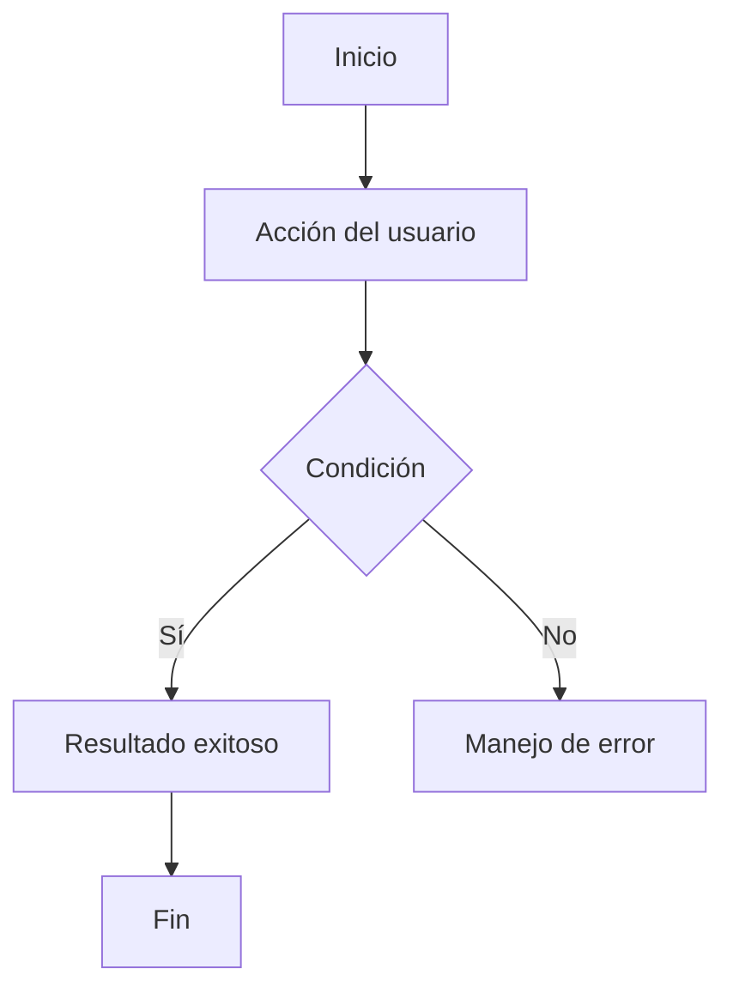

# Flow Creator

## Objetivo

Generar el flujo de usuario (user flow) de una funcionalidad, extrayendo información de documentos existentes antes de preguntar.

## Cuándo usarlo

- "crea el flujo de [funcionalidad]"
- "dame el flujo de [proceso]"
- "define el flujo para [historia / épica]"

## Instrucciones

### Paso 1 — Buscar información existente

1. **Revisar `docs-sync/`** para documentos relacionados:
   - Épicas → qué se busca lograr
   - Research/Journey Maps → flujos actuales, dolores en el proceso
   - Historias de usuario → acciones y resultados esperados
   - Kickoffs → escenarios y fases
2. **Extraer automáticamente:**
   - Tipo de usuario protagonista (de la épica/historia)
   - Punto de entrada y resultado final esperado
   - Pasos ya documentados
   - Condiciones o bifurcaciones mencionadas

### Paso 2 — Solo preguntar lo mínimo

**Preguntar solo si NO se puede inferir:**
- ¿Qué funcionalidad o proceso se va a mapear? (si no es obvio del contexto)

**Inferir automáticamente:**
- Tipo de usuario → del documento fuente
- Punto de entrada → del contexto de la funcionalidad
- Resultado esperado → del objetivo de la épica/historia

### Paso 3 — Generar el flujo

Las secciones y su orden oficial viven en `canon/dropi_methodology.md` → "Flujo de Usuario (User Flow)" (no redefinir esta lista aquí; si cambia, se actualiza solo ahí):

**a) Flujo narrativo (paso a paso)**
- Lista numerada desde el punto de entrada hasta el resultado final.
- Incluir bifurcaciones (si X entonces Y, si no entonces Z).
- Indicar qué hace el usuario y qué hace el sistema.

**b) Flujo en Mermaid**

**c) Casos alternativos y de error**
- Al menos 2-3 escenarios relevantes.

### Paso 4 — Ajustar nivel de detalle por tipo

- **UX:** perspectiva del usuario, decisiones, emociones
- **Frontend:** navegación, estados de UI, transiciones
- **Backend:** llamadas a API, validaciones, respuestas del sistema

### Paso 5 — Presentar como borrador

Presenta para revisión del usuario.

## Restricciones

- No inventar reglas de negocio no mencionadas.
- Los diagramas Mermaid deben ser válidos y ejecutables.
- **Extraer información de documentos existentes primero.**

## Salida esperada

Flujo de usuario paso a paso + diagrama Mermaid.
