# 🧬 Matriz Completa de Proyectos Darwin — Célula Seller Success (S2 2026)

> **Sincronización:** Documento de gobernanza y trazabilidad de los proyectos de la Célula Seller Success registrados en **Darwin** (`projects` en Supabase), incluyendo la jerarquía completa de **Proyectos Padres (Discovery)**, **POCs (`+ Crear POC`)**, **Delivery Proyectos (`+ Crear Delivery Proyecto`)**, **Estado Interno** y **Valor Potencial Validado (VPV)**.

---

## 📌 Jerarquía y Estructura Mapeada en Supabase

```mermaid
graph TD
    subgraph Discovery ["1. Proyectos Padre (Discovery)"]
        D1["PROD-WRAPPED: Dropi Wrapped"]
        D2["PRM-1239: Dropify 2.0 (APIs)"]
        D3["PROD-POOLMAX: Pauta Centralizada"]
        D4["PRM-1238: Page Pilot Landings"]
        D5["PROD-MUESTRA: Muestras 1-Clic"]
        D6["PROD-SEC-BEST: Second Best Fletes"]
        D7["PROD-HELP: Help Center SAC"]
        D8["GRO-002: Leyendas & Gamificación"]
        D9["TTV-001: Time to Value"]
    end

    subgraph POC ["2. + Crear POC (Experimento / Validación)"]
        P1["PROD-WRAPPED-POC-1: Retención Leyendas v7.0"]
        P2["PROD-580-POC-1: Sync APIs Multitienda"]
        P3["PROD-POOLMAX-POC-1: Reparto Pedidos Shopi"]
        P4["PROD-PILOT-POC-1: Ángulo Venta & Landings"]
        P5["PROD-MUESTRA-POC-1: Muestras Stock Privatizado"]
        P6["PROD-SEC-BEST-POC-1: Alerta Flete vs Cancelación"]
        P7["PROD-HELP-POC-1: Triaje 3.6K Tickets SAC"]
        P8["GRO-002-POC-1: Drops & Insignias v7.0"]
        P9["PROD-1478-POC-1: Reducción Latencia TTV"]
    end

    subgraph Delivery ["3. + Crear Delivery Proyecto (Desarrollo / Handoff)"]
        E1["PROD-WRAPPED-DEL-1: Frontend & Wrapped App"]
        E2["PROD-580-DEL-1: Integration Apps (Shopify/Woo/TiendaNube)"]
        E3["PROD-POOLMAX-DEL-1: Conector API PoolMax"]
        E4["PROD-PILOT-DEL-1: Beta 120 Comercios Page Pilot"]
        E5["PROD-MUESTRA-DEL-1: UI Botones & Autofill Ficha"]
        E6["PROD-SEC-BEST-DEL-1: Motor Enrutamiento Dynamic"]
        E7["PROD-HELP-DEL-1: Widget Flotante & Guías In-App"]
        E8["GRO-002-DEL-1: Módulo Leyendas In-App"]
        E9["PROD-1478-DEL-1: Acompañamiento 1er Despacho"]
    end

    D1 --> P1 --> E1
    D2 --> P2 --> E2
    D3 --> P3 --> E3
    D4 --> P4 --> E4
    D5 --> P5 --> E5
    D6 --> P6 --> E6
    D7 --> P7 --> E7
    D8 --> P8 --> E8
    D9 --> P9 --> E9
```

---

## 📊 Matriz Detallada de Campos Cargados en Darwin (`projects` table)

### 🚚 1. DELIVERY PROYECTOS (Zona de Tecnología, QA y Handoff)

| Iniciativa / Proyecto Delivery | Código Jira / Darwin | Tipo | Estado Interno (`estado_interno`) | Handoff Status | Prioridad | Copy Ejecutivo & Causa Raíz / Bloqueante |
| :--- | :---: | :---: | :---: | :---: | :---: | :--- |
| **Bugs Tienda Nube (V1)** | `STID-6598` | `Delivery Proyecto` | `en DEV` | `Handoff hecho` | **P0 (Urgente)** | **Objetivo:** Resolver 6 errores de integración críticos (sincronización de variables talla/color, importación masiva, webhooks inestables y direcciones sin Barrio/Piso). **Bloqueante P0:** Aún sin asignación de recurso dev en Jira por parte de ingeniería (Jose Giraldo). |
| **Tienda Nube V2 (Handoff)** | `DROP-25311` | `Delivery Proyecto` | `Pendiente Handoff` | `Listo para handoff` | **P1** | **Objetivo:** Pre-handoff de la nueva versión V2. **Estado:** En aclaración técnica liderada por Alejandra Melo con Diego Pérez sobre la estructura del submenú y la carga de imágenes. |
| **Page Pilot (Creación Landings)** | `PRM-1238-DEL` | `Delivery Proyecto` | `Pendiente Handoff` | `Handoff hecho` | **P1** | **Objetivo:** Facilitar maquetación de landings para novatos. **Estado:** Handoff a QA realizado por PD. Persisten errores en generación de landings y no se aplicó el campo obligatorio de Ángulo de Venta. |
| **Dropify Shopify 2.0** | `PROD-580` | `Delivery Proyecto` | `Pendiente Handoff` | `Handoff hecho` | **P2** | **Objetivo:** Re-arquitectura Built for Shopify y sync nativo. **Estado:** Pruebas PT2. Pendiente completar matriz de pruebas de fulfillment de combos con Alejandra Melo. |
| **Dropify WooCommerce** | `DROP-17355` | `Delivery Proyecto` | `en DEV` | `Handoff hecho` | **P0 (Incumplido)** | **Objetivo:** Migración completa del plugin de WooCommerce a React para paridad con Shopify 2.0. **Alerta TI:** Entrega pactada para el 4 de agosto **INCUMPLIDA por TI** (comunicaron el 3-Ago que no se tenía). Pendiente fecha oficial reprogramada por Jose Giraldo. |

---

### 🔬 2. DISCOVERY PROJECTS (Zona de Investigación, Mocks, Prototipado y Alineación)

| Iniciativa / Proyecto Discovery | Código Padre | Tipo Padre | Estado Interno Padre | Estado Real de Avance |
| :--- | :---: | :---: | :---: | :--- |
| **PoC Shopi / PoolMax** | `PROD-POOLMAX` | `Oportunidad` | `Activo` | 🟢 **Avanzado / Inicio esta semana:** Conversaciones adelantadas con Financiero, Legal y reunión realizada con Esteban y Arlex. Grupo de WhatsApp activo para comunicación directa. |
| **Módulo Notificaciones 360** | `PROD-1664` | `Proyecto` | `Activo` | 🎨 **Discovery:** Apenas en mockups y recolección de info de Novedades. |
| **Dropi Wrapped Leyendas 2026** | `PROD-WRAPPED` | `Idea` | `Ideación` | 🎨 **Discovery:** En fase de diseño UX/UI y prototipado. |
| **Muestras 1-Clic** | `PROD-MUESTRA` | `Idea` | `Ideación` | 🔬 **Discovery:** Prototipo finalizado, pendiente testeo de stock privatizado. |
| **Second Best Fletes** | `PROD-SEC-BEST` | `Oportunidad` | `Concepción de exp.` | 🔬 **Discovery:** Validación de sobrecostos de fletes con cohortes de sellers Pareto. |
| **Help Center SAC (Biblia AI)** | `PROD-HELP` | `Idea` | `Research` | 🔬 **Discovery:** Benchmark y triaje de 3.6K tickets con Pineda. |

---

## 🎯 Criterios de Asignación de Campos (PM Seller Success)

1. **Estado Interno (`estado_interno`):**
   * **Discovery Projects:** `Research` (fase inicial de datos), `Ideación` (diseño de oportunidad), `Concepción de experimento` (definición de test), `Activo` (corriendo en ciclo).
   * **Delivery Proyectos (`type = 'Delivery Proyecto'`):** `Pendiente Handoff` (Pre-handoff activo), `En QA` (pruebas de paridad/fulfillment), `en DEV` (desarrollo activo en TI).

2. **Valor Potencial Validado (VPV):**
   * Calculado como el valor económico estimado en COP del impacto en GMV, retención de sellers Pareto o ahorro en costos de soporte:
     * **Dropify 2.0:** $120M COP (volumen recuperado por integraciones API).
     * **PoolMax:** $85M COP (volumen escalado en comunidades por pauta centralizada).
     * **Leyendas & Wrapped:** $95M COP ($35M Wrapped + $60M Módulo) por retención del 87% del volumen Pareto.
     * **Help Center SAC:** $50M COP en ahorros de atención de soporte (deflexión 40%).

3. **Jerarquía Padres / Hijos:**
   * Todos los Delivery Proyectos están vinculados a su proyecto Discovery padre mediante `parent_project_id` y al POC correspondiente mediante `related_poc_id`.

