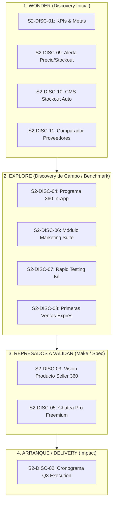

# 📘 Seller Success 2026 S2 — Especificación Oficial Confluence

> **Fuente Oficial:** [Confluence Space PD · Page 1483833347](https://dropi-it.atlassian.net/wiki/spaces/PD/pages/1483833347/Seller+Success+2026+S2)
> **Propietario:** Célula Seller Success (Célula Darwin)
> **Última sincronización:** 2026-07-30

---

## 1. OKR de Compañía que Impacta

* **OKR 1 / KR 1.1:** Aumentar la cantidad de órdenes a **7.8M órdenes/mes** (93.6M anuales).

---

## 2. Desglose de KPIs por Trimestre

| Trimestre | KPIs de la Célula | Definición Técnica |
| :--- | :--- | :--- |
| **Q3 (Jul–Sep)** | **Activación Bruta y Neta · TTV Bruto y Neto** | **Bruta:** Creó su 1ª orden (TTFO). **Neta:** Esa 1ª orden fue entregada (TTV). **TTV Bruto:** Tiempo desde registro hasta crear la 1ª orden. **TTV Neto:** Tiempo desde registro hasta entregar la 1ª orden. |
| **Q4 (Oct–Dic)** | **Churn y Crecimiento de Usuarios** | Por definir a partir de las exploraciones de Q3. `[TBD]` |

---

## 3. Product Backlog — Oportunidades a Validar (Discovery Checklist)

Este Product Backlog nace de dos consideraciones clave:
1. El reto de construir visión de retención/churn para Q4 mientras Q3 es activación, vía el **Programa 360**.
2. Las palancas y preguntas ya descubiertas para Q4.

> [!IMPORTANT]
> **Checklist Obligatorio:** Todos los ítems se validan progresivamente avanzando por las etapas de discovery: **Wonder → Explore → Make → Impact**.
> Muchos de estos ítems se exploran durante Q3 para convertirse en insumo directo de retención y escalamiento en Q4.

| # | Oportunidad / Proyecto | Fase Discovery | Entregable Concreto (Deliverable) | Fecha Objetivo | Alcance y Contexto |
|---|---|---|---|---|---|
| 1 | **Primera medición de KPIs y definición de meta** | **Wonder** | **Audit Report & Baseline Brief:** Medición factual en producción (46.2k DB) + acuerdo de metas CPO (5.2% $\to$ 8% Activación, TTV 16d $\to$ 12d, Retención 69.3% $\to$ 75%). | 1-Ago (Completado) | Tomar los KPIs principales asignados a la célula, medir estado real en DB y fijar metas oficiales con Dirección de Producto. |
| 2 | **Cronograma de ejecución de Q3 (Jul–Sep)** | **Arranque** | **Master Execution Roadmap Q3 (JPD):** Secuenciación de Delivery Backlog (Page Pilot, Dropify 2.0, Woo) + Discovery Backlog con asignación de Dev/UX y fechas. | 5-Ago | Qué proyectos se ejecutan/finalizan y en qué orden + primeras oportunidades a validar. *(Q4 se planifica al cierre de Q3)*. |
| 3 | **Visión de producto Seller** | **Represado (Validar)** | **Master Spec "Mapa de Valor Seller 360":** Matriz de oferta completa por nivel de madurez (Iniciando, Creciendo, Escalando) y cadena de valor (Catálogo, Órdenes, Wallet, CMS, Roax, Chatea Pro, Automatizaciones, Leyendas). | 15-Ago | Unir todo lo que ofrecemos al seller para Dropshippers y Marcas. Definir deliverable y fecha final. |
| 4 | **Programa 360 (Retención/Churn)** | **Explore** | **Blueprint Conductual "Programa 360 In-App":** Mapeo de palancas comerciales (GMV, ejecutivos asignados) traducidas a triggers y beneficios automáticos in-app. | 25-Ago | Mapear el programa 360 que Comercial hace a los dropshippers para entender palancas de crecimiento y bajarlas a la plataforma. |
| 5 | **Herramienta gratuita de mensajería (WhatsApp/SMS)** | **Represado (Validar)** | **Product Spec & Benchmark "Chatea Pro Freemium":** Reemplazo de ChatCenter definiendo mensajería masiva y automatizaciones básicas gratuitas junto a Brands Success & Venture Products. | 20-Ago | Proyecto conjunto Seller Success y Brands Success. Validar freemium de Chatea Pro para masivos y automatizaciones básicas. Benchmark vs competidores. |
| 6 | **Módulo de Marketing & Suite** | **Explore** | **Ficha de Integración Suite Marketing:** Especificación del módulo de marketing recopilando la suite de herramientas integradas (Minea, Meta Ads, TikTok, landing builders). | 30-Ago | Recopilar el módulo de marketing y todas las herramientas que van a salir allí para acelerar la captación y pauta del seller. |
| 7 | **Testeos más rápidos** | **Explore** | **"Rapid Testing Kit for Sellers":** Flujo simplificado para pruebas A/B de productos en < 24h (landings pre-configuradas + pauta exprés). | 5-Sep | Enfocarse en habilitar mecanismos de experimentación y testeo ágil para dropshippers. |
| 8 | **Primeras ventas más rápido** | **Explore** | **Onboarding Scaffolding Spec:** Wizard pre-configurado de tienda + 1er producto sugerido de alta rotación para reducir TTFO a < 4 días. | 10-Sep | Cómo ayudamos a los usuarios huérfanos a hacer sus primeras ventas más rápido. |
| 9 | **Alerta de Precio Recomendado y Stockout** | **Wonder** | **Opportunity Brief & Mock UI "Sugeridor de Margen & Preventivo Stockout":** Notificación in-app de margen óptimo y aviso antes de agotamiento. | 15-Sep | Indicarle proactivamente al dropshipper si puede vender su producto más caro o si se le va a agotar el stock. |
| 10 | **Automatización CMS ante Stockout** | **Wonder** | **Spec Técnico "Enrutamiento Dinámico CMS":** Desvío automático con CMS a proveedor secundario para mantener campañas encendidas sin pausar pauta. | 20-Sep | Automatizar integraciones CMS para que si se acaba el stock no se apague la campaña (redirección a stock de respaldo). |
| 11 | **Comparador de Proveedores, Precios y Ranking** | **Wonder** | **Benchmark & Mock UI "Matriz Comparadora de Proveedores":** Interfaz de comparación de precios de costo, tiempos de despacho y reputación del proveedor. | 25-Sep | Permitir al dropshipper comparar fácilmente entre proveedores, precios y puntaje de cumplimiento. |

---

## 4. Gobernanza y Matriz de Entregables (Deliverables Spec)

