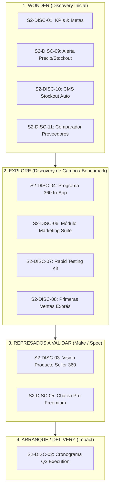

# 📘 Seller Success 2026 S2 — Especificación Oficial Confluence

> **Fuente Oficial:** [Confluence Space PD · Page 1483833347](https://dropi-it.atlassian.net/wiki/spaces/PD/pages/1483833347/Seller+Success+2026+S2)
> **Propietario:** Célula Seller Success (Célula Darwin)
> **Última sincronización:** 2026-07-30

---

## 1. OKR de Compañía que Impacta

* **OKR 1 / KR 1.1:** Aumentar la cantidad de órdenes a **7.8M órdenes/mes** (93.6M anuales).

---

## 2. Desglose de KPIs por Trimestre

| Trimestre | KPIs de la Célula | Definición Técnica |
| :--- | :--- | :--- |
| **Q3 (Jul–Sep)** | **Activación Bruta y Neta · TTV Bruto y Neto** | **Bruta:** Creó su 1ª orden (TTFO). **Neta:** Esa 1ª orden fue entregada (TTV). **TTV Bruto:** Tiempo desde registro hasta crear la 1ª orden. **TTV Neto:** Tiempo desde registro hasta entregar la 1ª orden. |
| **Q4 (Oct–Dic)** | **Churn y Crecimiento de Usuarios** | Por definir a partir de las exploraciones de Q3. `[TBD]` |

---

## 3. Product Backlog — Oportunidades a Validar (Discovery Checklist)

Este Product Backlog nace de dos consideraciones clave:
1. El reto de construir visión de retención/churn para Q4 mientras Q3 es activación, vía el **Programa 360**.
2. Las palancas y preguntas ya descubiertas para Q4.

> [!IMPORTANT]
> **Checklist Obligatorio:** Todos los ítems se validan progresivamente avanzando por las etapas de discovery: **Wonder → Explore → Make → Impact**.
> Muchos de estos ítems se exploran durante Q3 para convertirse en insumo directo de retención y escalamiento en Q4.

| # | Oportunidad / Reto CPO | Fase Discovery | Estado del Deliverable | Reto Estratégico a Resolver en S2 |
|---|---|---|---|---|
| 1 | **Primera medición de KPIs y definición de meta** | **Wonder** | ✅ `[COMPLETADO]` Audit Report & Metas | Medición factual en producción (46.2k DB) + metas CPO oficializadas (5.2% $\to$ 8% Activación, TTV 16d $\to$ 12d, Retención 69.3% $\to$ 75%). |
| 2 | **Cronograma de ejecución de Q3 (Jul–Sep)** | **Arranque** | ⚙️ `[EN CURSO]` Master Roadmap Q3 | Definir orden de ejecución del Delivery Backlog (Page Pilot, Dropify 2.0, Woo) + Discovery Backlog con asignación de Dev/UX. |
| 3 | **Visión de producto Seller** | **Represado · Validar** | 🔍 `[POR DEFINIR — Reto CPO S2]` | Unir la oferta completa al seller por nivel de madurez y cadena de valor (Catálogo, Órdenes, Wallet, CMS, Roax, Chatea Pro, Automatizaciones, Leyendas). Definir deliverable y fecha. |
| 4 | **Programa 360 (Retención/Churn)** | **Explore** | 🔍 `[POR DEFINIR — Reto CPO S2]` | Mapear el programa 360 comercial (GMV) para entender palancas de crecimiento y bajarlas in-app a la plataforma. |
| 5 | **Herramienta gratuita de mensajería (WhatsApp/SMS)** | **Represado · Validar** | 🔍 `[POR DEFINIR — Reto CPO S2]` | Reemplazo de ChatCenter con Chatea Pro Freemium (masivos + automatización básica) en conjunto con Brands Success. |
| 6 | **Módulo de Marketing & Herramientas** | **Explore** | 🔍 `[POR DEFINIR — Reto CPO S2]` | Recopilar el módulo de marketing y la suite de herramientas que saldrán allí para acelerar la captación del seller. |
| 7 | **Enfocarse en testeos más rápidos** | **Explore** | 🔍 `[POR DEFINIR — Reto CPO S2]` | Habilitar mecanismos de experimentación y testeo exprés de productos/pautas para dropshippers. |
| 8 | **Primeras ventas más rápido** | **Explore** | 🔍 `[POR DEFINIR — Reto CPO S2]` | Reducir la fricción inicial para acelerar el Time-to-First-Order (TTFO) y TTV neto del dropshipper. |
| 9 | **Alerta de Precio Recomendado y Stockout** | **Wonder** | 🔍 `[POR DEFINIR — Reto CPO S2]` | Indicarle proactivamente al dropshipper si puede vender su producto más caro o si se le va a agotar el stock. |
| 10 | **Automatización integraciones CMS ante Stockout** | **Wonder** | 🔍 `[POR DEFINIR — Reto CPO S2]` | Automatizar desvío con CMS a proveedor secundario para mantener campañas encendidas sin pausar pauta. |
| 11 | **Comparador de Proveedores, Precios y Ranking** | **Wonder** | 🔍 `[POR DEFINIR — Reto CPO S2]` | Habilitar comparación in-app entre proveedores, precios de costo y puntaje de reputación/cumplimiento. |

---

## 4. Gobernanza y Matriz de Entregables (Deliverables Spec)

