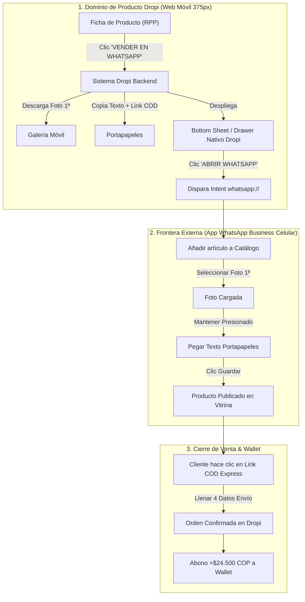

# 🧪 Especificación de Proyecto: Asistente Exportador a WhatsApp Business (`PROD-EXP-WPP-NOVATOS`)
## Célula Seller Success · Dropi S2 2026

---

## 📌 1. Tarjeta Ejecutiva del Proyecto
* **ID Jira:** `PROD-EXP-WPP-NOVATOS`
* **Célula:** Seller Success (Darwin)
* **PM / Lead:** Santiago Herrera | **UX Lead:** Alejandra Melo
* **Fase JPD:** **Make** (Especificación Fiel a Producción & Handoff a TI)
* **Estado Interno:** 🚀 Prioridad Alta (Activación de Novatos Huérfanos en $0$ órdenes)

---

## 🎯 2. Contrato de Intent & Límites de UI (Discovery Pre-Flight)

```
 ┌─────────────────────────────────────────────────────────────────────────────────┐
 │ 1. Actor Activo:           Dropshipper Novato Huérfano ($0$ órdenes entregadas) │
 │ 2. Contexto Dispositivo:   Web Móvil Responsive (Viewport 375px)                │
 │ 3. Dominio de UI (Dropi):   Ficha de producto + Bottom Sheet / Drawer Nativo     │
 │ 4. Frontera Externa:       WhatsApp Business App (Documentado en Mermaid)       │
 │ 5. Design System Baseline: Dropi RPP System (Tokens de color y tipografía Inter)  │
 └─────────────────────────────────────────────────────────────────────────────────┘
```

* **Regla de Dominio Visual:** Toda la interfaz vive **únicamente en la Web Móvil de Dropi**. Prohibido maquetar dispositivos de terceros o marquetes teatrales en la UI de producción.

---

## 📊 3. Grounding de Datos 360° & Supabase
* **Población Objetivo:** 15.659 usuarios huérfanos en `userpilot_suppliers` (0 órdenes entregadas).
* **Métrica Factual:** El **96.87% jamás vincula un producto** (`real_products_created` = 3.13%). Mediana de TTV Neto = **16.0 días**.
* **Baseline vs. Meta del Proyecto:**
  * *Tasa de Activación Neta:* Baseline **5.2%** $\to$ **Meta $\ge 15.0\%$**.
  * *Time-to-Value (TTV):* Baseline **16.0 días** $\to$ **Meta < 24 horas**.

---

## 🧠 4. Diagnóstico Conductual B=MAP & Trilema de Fricción

### A. Diagnóstico B=MAP
* **Motivación (M):** MEDIA-ALTA (El novato quiere generar su primera ganancia rápida de $20.000+ COP).
* **Ability (A) / Fricción:** EXTREMADAMENTE BAJA (Parálisis por sobrecarga cognitiva al exigirle maquetar tiendas en Shopify o configurar APIs en Meta).
* **Prompt (P):** Botón verde nativo en la Ficha de Producto: *"VENDER EN WHATSAPP (CARGA EN 10 SEG)"*.

### B. Trilema de Fricción
1. **ELIMINAR:** Maquetación de tiendas online, configuración de dominios y vincular Meta Business Manager.
2. **PRESERVAR:** Elección consciente del producto ganador y confirmación de datos en WhatsApp.
3. **INVERTIR (Investment):** Compartir el link de pedido COD Express con sus contactos o en su perfil.

---

## 🗺️ 5. User Flow Narrativo y Diagrama Mermaid

### A. Flujo Narrativo Paso a Paso
1. **Paso 1 (En Dropi Web Móvil):** El novato explora el catálogo, ve la ganancia (+$24.500 COP) y toca *"VENDER EN WHATSAPP (CARGA EN 10 SEG)"*.
2. **Paso 2 (Acción del Sistema Dropi):** Dropi descarga automáticamente la foto principal a su galería rápida y copia al portapapeles el texto del producto + link de pedido COD (`https://app.dropi.co/express/p98211?seller=user123`).
3. **Paso 3 (Drawer Nativo Dropi):** Se abre el Bottom Sheet de Dropi indicando los 3 toques finales y el CTA *"ABRIR MI WHATSAPP BUSINESS AHORA"*.
4. **Paso 4 (Frontera Externa - WhatsApp Nativo):** El novato abre WhatsApp Business ➔ *Catálogo ➔ Añadir artículo*, selecciona la 1ª foto y toca *Pegar* ➔ *Guardar*.
5. **Paso 5 (Cliente Final):** El cliente ve la vitrina del perfil, solicita el producto y llena el formulario Express COD de 4 campos.

### B. Diagrama Mermaid de Fronteras de Dominio



---

## 📋 6. Paquete Jira: Épicas e Historias en Sintaxis Gherkin

### Épica Jira: `DROPI: Asistente Exportador a WhatsApp Business_Colombia_Novatos`

#### 🔵 Historia 1: `[Frontend] DROPI Botón Nativo y Bottom Sheet de Asistencia`
```gherkin
Como Dropshipper Novato en la Web Móvil de Dropi,
Quiero presionar el botón "VENDER EN WHATSAPP" y ver el Drawer de asistencia con acciones automáticas,
Para exportar el producto a mi celular en menos de 10 segundos sin configurar plataformas complejas.

Escenario: Activación del Drawer de Carga Asistida
  Dado que el seller está autenticado en la Web Móvil de Dropi en la Ficha de Producto "DROPI-98211"
  Cuando hace clic en el botón "VENDER EN WHATSAPP (CARGA EN 10 SEG)"
  Entonces el sistema descarga la foto principal a su galería móvil en la primera posición
  Y copia al portapapeles el texto pre-redactado (Título, Precio $89.900, Descripción y Link COD Express)
  Y despliega el Bottom Sheet de Dropi con la guía de 3 toques y el botón "ABRIR MI WHATSAPP BUSINESS AHORA".
```

#### 🟢 Historia 2: `[Backend] DROPI Endpoint de Generación de Textos y Links Express COD`
```gherkin
Como Sistema Backend de Dropi,
Quiero generar el slug dinámico y el payload formateado para el portapapeles,
Para garantizar que el enlace de compra COD atribuya la comisión directamente al seller que exportó.

Escenario: Generación de Link COD Atribuido
  Dado que un seller con ID "user123" solicita exportar el producto "DROPI-98211"
  Cuando el endpoint "POST /api/v1/express-checkout/link" es invocado
  Entonces el sistema retorna la URL formateada "https://app.dropi.co/express/p98211?seller=user123"
  Y empaqueta la plantilla de texto persuasivo lista para copiado.
```

#### 🟡 Historia 3: `[QA] Matriz de Pruebas de Descarga y Copiado en Dispositivos Móviles`
* **Definición de Hecho (DoD):**
  - [x] Probado en Safari iOS (versiones 16+) y Chrome Android (versiones 115+).
  - [x] Verificado que el permiso de portapapeles no bloquee la ejecución.
  - [x] Confirmado que la descarga de la imagen se guarde en el carrete nativo.
  - [x] Atribución de comisión verificada en base de datos al completar una orden COD Express.

---

## 📈 7. Eventos de Tracking & Matriz de Impacto Cruzado

### Eventos a Instrumentar en Segment / Mixpanel:
* `click_export_wpp_button`
* `image_download_success`
* `text_copied_to_clipboard`
* `drawer_assistant_opened`
* `open_whatsapp_intent_click`
* `order_express_cod_created`

### Matriz de Impacto Cruzado:
* **Legal:** Sin impacto de T&Cs adicionales (el dropshipper vende en su propio canal de WhatsApp).
* **DBA:** Reutiliza las tablas `orders` y `suppliers` de Supabase sin agregar esquemas complejos.
* **Performance:** La descarga de imágenes usa CDN optimizada ($<150$ KB por foto).

---

## 🔗 8. Traza Discovery ➔ Delivery
* **Epic Jira:** `PROD-EXP-WPP-NOVATOS`
* **Prototipo Interactivo Fiel (Móvil 375px):** [asistente-carga-wpp-poc.html](file:///Users/santiago.herrera/Downloads/dropi-agente-pm/hub/public/prototipos/asistente-carga-wpp-poc.html)
