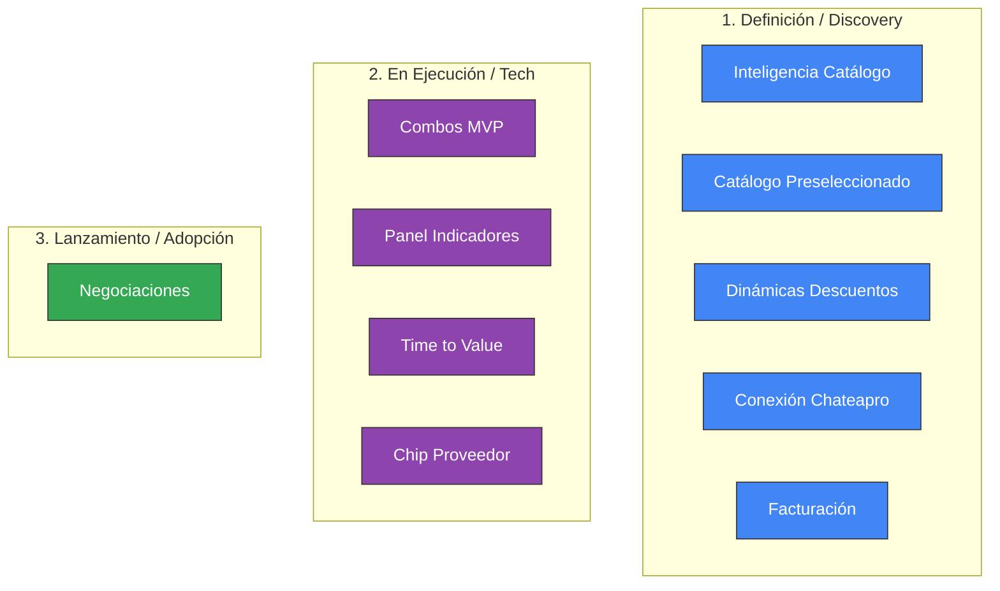

# Reporte Gerencial Semanal — Célula Supplier Success
**Fecha de Corte:** 2026-05-14 | **Generado el:** 2026-06-09

---
## 📈 Dashboard de Métricas de Negocio y Operación
La célula Supplier Success mide su impacto en una estructura de 4 niveles, desde negocio hasta onboarding operativo:
### 🌍 Global (Todos los Países)

| Nivel | Métrica | Valor | Tendencia | Estado |
|---|---|---|---|---|
| 1. Negocio (GMV) | GMV | **$46.484** | ▲ +12% | 🟢 Bueno |
| 1. Negocio (GMV) | Volumen de Órdenes | **1.921** | ▲ +8% | 🟢 Bueno |
| 2. Adopción/Salud | Tasa de Activación | **65.3%** | ▲ +5.4pp | 🟢 Bueno |
| 2. Adopción/Salud | Proveedores Activos (A15) | **341** | ▲ +15% | 🟢 Bueno |
| 2. Adopción/Salud | Proveedores Activos (A30) | **542** | ▲ +11% | 🟢 Bueno |
| 2. Adopción/Salud | Ticket Promedio (AOV) | **$23.5** | ▶ → estable | ⚪ Neutral |
| 2. Adopción/Salud | Salud del Catálogo | **75.4%** | ▲ +2pp | 🟢 Bueno |
| 3. Eficiencia | % Completion Checklist | **73.5%** | ▲ +6pp | 🟢 Bueno |
| 3. Eficiencia | % Sincronización Externa | **41.3%** | ▲ +4pp | 🟢 Bueno |
| 3. Eficiencia | Conversión de Negociaciones | **46.7%** | ▶ → estable | ⚪ Neutral |
| 3. Eficiencia | Time to First Sale | **7.4 días** | ▼ -1.8 días | 🟡 Advertencia |

<b>Ver métricas detalladas de 🇨🇴 Colombia</b>

| Nivel | Métrica | Valor | Tendencia | Estado |
|---|---|---|---|---|
| 1. Negocio (GMV) | GMV | **$20.660** | ▲ +12% | 🟢 Bueno |
| 1. Negocio (GMV) | Volumen de Órdenes | **854** | ▲ +8% | 🟢 Bueno |
| 2. Adopción/Salud | Tasa de Activación | **64.5%** | ▲ +5.4pp | 🟢 Bueno |
| 2. Adopción/Salud | Proveedores Activos (A15) | **152** | ▲ +15% | 🟢 Bueno |
| 2. Adopción/Salud | Proveedores Activos (A30) | **241** | ▲ +11% | 🟢 Bueno |
| 2. Adopción/Salud | Ticket Promedio (AOV) | **$24.8** | ▶ → estable | ⚪ Neutral |
| 2. Adopción/Salud | Salud del Catálogo | **74.9%** | ▲ +2pp | 🟢 Bueno |
| 3. Eficiencia | % Completion Checklist | **72.6%** | ▲ +6pp | 🟢 Bueno |
| 3. Eficiencia | % Sincronización Externa | **40.3%** | ▲ +4pp | 🟢 Bueno |
| 3. Eficiencia | Conversión de Negociaciones | **48.4%** | ▶ → estable | ⚪ Neutral |
| 3. Eficiencia | Time to First Sale | **7.2 días** | ▼ -1.8 días | 🟡 Advertencia |
| 4. Onboarding | Postulaciones Ascenso | **8** | ▲ +20% | 🟢 Bueno |
| 4. Onboarding | TAT de Auditoría | **19.3h** | ▼ -6.2h | 🟢 Bueno |

<b>Ver métricas detalladas de 🇲🇽 México</b>

| Nivel | Métrica | Valor | Tendencia | Estado |
|---|---|---|---|---|
| 1. Negocio (GMV) | GMV | **$15.495** | ▲ +12% | 🟢 Bueno |
| 1. Negocio (GMV) | Volumen de Órdenes | **640** | ▲ +8% | 🟢 Bueno |
| 2. Adopción/Salud | Tasa de Activación | **66.4%** | ▲ +5.4pp | 🟢 Bueno |
| 2. Adopción/Salud | Proveedores Activos (A15) | **114** | ▲ +15% | 🟢 Bueno |
| 2. Adopción/Salud | Proveedores Activos (A30) | **181** | ▲ +11% | 🟢 Bueno |
| 2. Adopción/Salud | Ticket Promedio (AOV) | **$23.8** | ▶ → estable | ⚪ Neutral |
| 2. Adopción/Salud | Salud del Catálogo | **73.2%** | ▲ +2pp | 🟢 Bueno |
| 3. Eficiencia | % Completion Checklist | **73%** | ▲ +6pp | 🟢 Bueno |
| 3. Eficiencia | % Sincronización Externa | **40.6%** | ▲ +4pp | 🟢 Bueno |
| 3. Eficiencia | Conversión de Negociaciones | **48.4%** | ▶ → estable | ⚪ Neutral |
| 3. Eficiencia | Time to First Sale | **7.6 días** | ▼ -1.8 días | 🟡 Advertencia |
| 4. Onboarding | Postulaciones Ascenso | **6** | ▲ +20% | 🟢 Bueno |
| 4. Onboarding | TAT de Auditoría | **22.6h** | ▼ -6.2h | 🟢 Bueno |

<b>Ver métricas detalladas de 🇪🇨 Ecuador</b>

| Nivel | Métrica | Valor | Tendencia | Estado |
|---|---|---|---|---|
| 1. Negocio (GMV) | GMV | **$10.330** | ▲ +12% | 🟢 Bueno |
| 1. Negocio (GMV) | Volumen de Órdenes | **427** | ▲ +8% | 🟢 Bueno |
| 2. Adopción/Salud | Tasa de Activación | **64.6%** | ▲ +5.4pp | 🟢 Bueno |
| 2. Adopción/Salud | Proveedores Activos (A15) | **76** | ▲ +15% | 🟢 Bueno |
| 2. Adopción/Salud | Proveedores Activos (A30) | **121** | ▲ +11% | 🟢 Bueno |
| 2. Adopción/Salud | Ticket Promedio (AOV) | **$24.0** | ▶ → estable | ⚪ Neutral |
| 2. Adopción/Salud | Salud del Catálogo | **73.1%** | ▲ +2pp | 🟢 Bueno |
| 3. Eficiencia | % Completion Checklist | **72%** | ▲ +6pp | 🟢 Bueno |
| 3. Eficiencia | % Sincronización Externa | **41.3%** | ▲ +4pp | 🟢 Bueno |
| 3. Eficiencia | Conversión de Negociaciones | **45.6%** | ▶ → estable | ⚪ Neutral |
| 3. Eficiencia | Time to First Sale | **7.1 días** | ▼ -1.8 días | 🟡 Advertencia |
| 4. Onboarding | Postulaciones Ascenso | **4** | ▲ +20% | 🟢 Bueno |
| 4. Onboarding | TAT de Auditoría | **22.2h** | ▼ -6.2h | 🟢 Bueno |

---
## 🗺️ Estado de Portafolio de Proyectos

| Proyecto | Estado | Owner | Avance y Próximo Hito |
|---|---|---|---|
| 🔵 **Inteligencia / Data de Catálogo** | `Discovery` | Jaime Guevara | Investigación manual de los 67 suppliers de mayor rendimiento en Dropi. Objetivo: identificar patrones de catálogo que expliquen la productividad (órdenes/producto). Metodología: pantallazos de perfil + catálogo + detalle producto a producto. Avance: 5 investigados, 1 excluido (marca). Hallazgos iniciales: especialización > tamaño, operación confiable compensa ficha débil, catálogo privado puede ser gap crítico, JSON roto es issue de plataforma (HTML→texto plano). Ángulo de producto validado con jefe: no mostrar top sellers (canibaliza mercado) — encontrar productos ganadores sin movimiento con señal de mercado. |
| 🔵 **Cellboard** | `Discovery` | Jaime Guevara | Visión de producto para organizar la conversación de la célula Supplier Success alrededor de activación de suppliers, salud de catálogo, catálogo trend, combos y métricas reales de crecimiento. |
| 🔵 **Supplier Data & Dashboard** | `Discovery` | Jaime Guevara | Levantamiento de data estructurada de suppliers (cuantitativa y cualitativa) para construir un dashboard centralizado que facilite la toma de decisiones basada en puntos de dolor. |
| 🔵 **Outcome Signal** | `Discovery` | Jaime Guevara | Módulo de medición de efectividad de proyectos implementados. Conecta fuentes de comportamiento de usuario como (UserPilot) para evaluar si los proyectos lograron adopción, conversión y los outcomes esperados. |
| 🔵 **Dinámicas de Catálogo** | `Discovery` | Jaime Guevara | Macroproyecto que agrupa las dinámicas comerciales del catálogo Dropi. Objetivo: pasar de un catálogo estático a uno accionable donde suppliers y dropshippers participen en dinámicas como combos, campañas, descuentos y negociaciones para mover más ventas. Sub-proyectos: Combos (COM-001, ya en proceso), Catálogo Preseleccionado (DCA-001), Dinámicas de Descuentos (DCA-002), Negociaciones Supplier-Dropshipper (DCA-003). |
| 🔵 **Supplier Journey Mapping & Activation Lab** | `Discovery` | Jaime Guevara | Levantar, documentar y analizar en profundidad el journey real que vive un supplier dentro de Dropi, desde su registro inicial hasta su activación operativa y comercial dentro de la plataforma. |
| 🔵 **Dinámicas de Descuentos** | `Discovery` | Jaime Guevara | Discovery para entender cómo deben funcionar descuentos, promociones y reglas comerciales en Dropi. Casos: remates, descuentos por volumen, liquidación, campañas, Black Friday, mover stock quieto. Sub-proyecto de DCA-000 Dinámicas de Catálogo. |
| 🟣 **Chip del Proveedor** | `In Progress` | Jaime Guevara | Mejora del perfil del proveedor: nuevos campos y enriquecimiento de datos para dar más contexto a dropshippers. Handoff de diseño completado con Alejandra. Pendiente: levantar campos adicionales y entregar historias a tech para pasar a desarrollo. |
| 🔵 **Catálogo Preseleccionado** | `Discovery` | Jaime Guevara | Discovery y AS-IS completados (2026-05-26). Pendiente: entrevistas con suppliers para cerrar investigación. Una vez cerradas, presentar a la célula para co-construcción. Producto ya tiene propuesta inicial — se busca complementar y validar con el equipo antes de definir alcance. |
| 🟣 **Panel de indicadores / métricas de proveedores** | `In Progress` | Jaime Guevara | Dashboard centralizado de métricas de proveedores en estabilización. Adopción en declive; se enviará experimento desde UserPilot para motivar a proveedores a revisar su panel y postularse para ascenso. |
| 🔵 **Negociaciones Supplier-Dropshipper** | `Discovery` | Jaime Guevara | Discovery completo para entender si Dropi debe habilitar una dinámica de negociación entre suppliers y dropshippers. Esta semana se inició trabajo con Michelle en la contextualización y flujo end-to-end, con meta de pasar a desarrollo la próxima semana. |
| 🟢 **Negociaciones** | `Lanzamiento` | Jaime Guevara | Liberado a producción. Bug crítico: no visible para proveedores (redirecciona a Home y desaparece). La líder de comunidades requiere data puntual de negociaciones para arqueos (se extraerá a Excel vía Miguel/José temporalmente para evitar desarrollo). José canceló seguimiento de hoy. |
| 🟣 **Combos** | `In Progress` | Jaime Guevara | José Giraldo no asistió a la sync; nueva fecha estimada al 30 de junio de 2026, con alta incertidumbre por falta de respuestas. El MVP incluye CAS y ECOM. |
| 🟣 **Time to Value** | `In Progress` | Jaime Guevara | TOBE completo definido. Foco: maximizar tiempos de registro/activación. Comercial y Operaciones presentaron plan de implementación de pipeline (estimado 1 semana para arrancar y medir). |
| 🔵 **Conexión Chateapro** | `Discovery` | Jaime Guevara | Integración entre Dropi y Chateapro (app del holding para vender productos por WhatsApp vía agentes IA). Fase 1: token de autenticación para validar proveedores de forma segura + sincronización de stock por ID de producto Dropi. Fase futura: coronita azul en catálogo Dropi para productos con prompt optimizado en Chateapro. |
| 🔵 **Combos Dropshipper** | `Discovery` | Jaime Guevara | Habilitar que el dropshipper pueda crear sus propios combos. Esta semana se inició trabajo con Michelle en la contextualización y flujo end-to-end, con meta de pasar a desarrollo la próxima semana. |
| 🟢 **Facturación Dropshipper - Suppliers** | `Terminado` | Jaime Guevara | Entregado. José informó que el proyecto ya se entregó. Se marca como terminado y sale de actualizaciones activas. |

---
## 🚨 Riesgos y Alertas Críticas (Semáforo)
- 🔴 **[High Impacto] Performance en badge por producto** (Estado: `Open`): El componente de badge/métrica en detalle de producto generaba consultas en tiempo real por cada carga de producto, con riesgo de caída por volumen en producción. La solución de cálculo nocturno fue propuesta pero no está validada ni confirmada como implementada. *Mitigación:* Confirmar con el equipo técnico si el cálculo nocturno fue implementado. Si no, crear historia para construirlo antes de reactivar el componente.
- 🟡 **[Medium Impacto] Inconsistencia entre fuentes de datos** (Estado: `Open`): CRM, UserPilot y el dashboard de indicadores pueden estar midiendo eventos distintos o con criterios diferentes. Si no se valida, hay riesgo de reportar métricas incorrectas o tomar decisiones basadas en datos no comparables. *Mitigación:* Mapear qué mide cada herramienta para los mismos eventos. Documentar diferencias y definir fuente única de verdad por métrica.
- 🔴 **[High Impacto] Bloqueo legal prolongado sin fecha compromiso** (Estado: `Open`): El módulo está listo pero inactivo. Sin una fecha compromiso de Legal para el documento de T&Cs, el bloqueo puede extenderse indefinidamente. Cada semana de retraso tiene costo de oportunidad real: el módulo ya demostró demanda (182 proveedores en la primera semana). *Mitigación:* Contactar a Angélica con urgencia, confirmar nombre del documento y obtener fecha compromiso. Si no hay respuesta en 48h, escalar con el responsable del área legal.
- 🔴 **[High Impacto] Construir solo interfaz sin resolver la cadena operativa** (Estado: `Open`): Se puede construir una pantalla funcional para el dropshipper pero sin resolver cómo el combo afecta stock, garantías, proveedor, fulfillment y soporte. El resultado sería una feature visualmente completa pero operativamente rota. *Mitigación:* Completar la definición end-to-end antes de escribir cualquier historia de desarrollo. Validar con sesión multidisciplinaria.
- 🔴 **[High Impacto] Romper integraciones con canales externos (Shopify, Tienda Nube, Dropify)** (Estado: `Open`): El combo puede funcionar correctamente dentro de Dropi pero comportarse mal al sincronizarse con canales externos. El canal puede no soportar bundles, puede calcular mal el stock o la orden puede regresar a Dropi en un formato inesperado. *Mitigación:* Validar compatibilidad técnica con el equipo de Integraciones antes del desarrollo. Definir explícitamente qué canales son soportados en MVP.
- 🔴 **[High Impacto] Garantías no modeladas para productos agrupados en combo** (Estado: `Open`): La funcionalidad actual de garantías está modelada por producto individual. Un combo puede generar casos no soportados: reclamo parcial, devolución de un solo componente, producto con garantía y otro sin ella dentro del mismo combo. *Mitigación:* Definir explícitamente el modelo de garantía para MVP (recomendado: garantía por producto componente). Validar con Soporte, Legal y Producto.
- 🔴 **[High Impacto] Inconsistencia de stock: combo visible con componentes agotados** (Estado: `Open`): Si no se implementa la lógica correcta, un combo puede seguir visible y vendible aunque uno de sus productos esté sin stock, generando órdenes incumplibles y mala experiencia para el comprador y el proveedor. *Mitigación:* Definir y validar con Tech la lógica de stock del combo: disponibilidad = mínimo entre stocks de componentes. Implementar desactivación automática si un componente llega a cero.
- 🟡 **[Medium Impacto] Confusión del proveedor al recibir una orden con combo** (Estado: `Open`): Si no se define claramente cómo llega la orden al proveedor, este puede recibirla como un producto desconocido, sin entender que contiene varios componentes ni cómo empacarlo o despacharlo. Genera errores operativos y mala experiencia del proveedor. *Mitigación:* Definir antes de desarrollo cómo se representa una orden con combo en la vista del proveedor. Incluir historia de usuario explícita para el proveedor.
- 🟡 **[Medium Impacto] Mala medición: no se valida si combos realmente aumentan ticket promedio** (Estado: `Open`): Se puede lanzar combos sin métricas configuradas desde el inicio, impidiendo saber si el proyecto realmente movió el OKR de ticket promedio o si solo redistribuyó ventas que ya iban a ocurrir. *Mitigación:* Definir plan de medición antes del lanzamiento: GMV por combos, ticket promedio con/sin combo, conversión, tasa de reclamos. Configurar eventos desde el primer release.
- 🟡 **[Medium Impacto] Reproceso en diseño por ajuste de aceptación del líder de comunidad** (Estado: `Mitigated`): El diseño actual ya está desarrollado sin contemplar la validación de aceptación de T&Cs por parte del líder de comunidad. Incorporar este paso puede requerir cambios en el flujo ya diseñado y aprobado, generando reproceso con Aleja y potencialmente retrasando el lanzamiento. *Mitigación:* Coordinar con Aleja la solución más liviana posible (modal adicional, validación inline, etc.) para no rehacer el flujo completo. Definir alcance antes de comprometer tiempo de diseño.
- 🔴 **[High Impacto] Proceso de curación no escalable** (Estado: `Open`): Sin claridad de quién define y cura el catálogo de campaña, el proceso puede volverse manual e inviable a escala *Mitigación:* Definir en el discovery quién es el dueño del proceso y qué puede automatizarse
- 🔴 **[High Impacto] Devaluación del catálogo por descuentos mal diseñados** (Estado: `Open`): Descuentos sin reglas claras pueden afectar la percepción de precio y el equilibrio del ecosistema *Mitigación:* Definir en el discovery las reglas de negocio y quién absorbe el descuento antes de construir
- 🔴 **[High Impacto] Inequidad entre dropshippers por negociaciones privadas** (Estado: `Open`): Una negociación mal estructurada puede generar ventajas para algunos dropshippers y conflictos en el ecosistema *Mitigación:* Definir en el discovery si las condiciones son públicas o privadas y cómo se auditan
- 🔴 **[High Impacto] Invertir en producto sin validar impacto económico** (Estado: `Open`): Proponer solución de desarrollo antes de cuantificar el GMV potencial no capturado *Mitigación:* Lineamiento claro: primero análisis con Growth y Comercial, luego decisión de solución
- 🟡 **[Medium Impacto] Data de suppliers represados no disponible** (Estado: `Open`): La información puede estar dispersa o sin estructura suficiente para el análisis *Mitigación:* Involucrar a Data desde el inicio para identificar fuentes disponibles
- 🟡 **[Medium Impacto] Data del catálogo dispersa o no estructurada** (Estado: `Open`): Sin data confiable no se pueden generar insights accionables ni dashboards útiles *Mitigación:* Comenzar mapeando qué data existe, dónde está y qué calidad tiene antes de analizar
- 🔴 **[High Impacto] Sincronización con Shopify bloqueada** (Estado: `Open`): El flujo de exportación de combos a Shopify no funciona cuando el combo incluye productos con variantes. El flujo inverso (orden Shopify → Dropi con combo) tampoco está probado. Shopify es la integración que genera más órdenes. *Mitigación:* José Giraldo se llevó las épicas para revisión. Estimación técnica pendiente. No lanzar Combos a usuarios hasta que este flujo esté validado.
- 🟡 **[Medium Impacto] Gestión masiva por CSV no disponible** (Estado: `Open`): Los combos solo pueden gestionarse manualmente. La carga masiva mediante CSV no está implementada, lo que limita la escala de uso para proveedores con muchos productos. *Mitigación:* Incluir como parte de la estimación técnica con José. Definir si entra en Fase 1 o Fase 2.
- 🔴 **[High Impacto] CRM de proveedores sin flujo definido** (Estado: `Open`): El CRM no tiene pipeline configurado para proveedores. Kevin y Eric (2 personas) atienden todo el volumen sin datos de registros diarios, sin segmentación por potencial, y sin flujo de contacto comercial definido. Marlon y el equipo no han retomado la configuración del CRM para proveedores. *Mitigación:* Marlon confirmó que retomará la configuración del CRM para proveedores. Coordinar con Emerson y Kevin para definir el flujo antes de arrancar acciones de activación.
- 🟡 **[Medium Impacto] Contaminación de categorías por sobreclasificación** (Estado: `Open`): Los proveedores en Dropi asignan múltiples categorías a sus productos para aparecer en más búsquedas, lo que puede contaminar el análisis del Insight 2 (Categorías que más venden). *Mitigación:* Revisar API de clasificación sugerida por Juandi o definir reglas de limpieza de categorías.
- 🔴 **[High Impacto] Velocidad de desarrollo lenta en ambos equipos** (Estado: `Open`): Tanto Dropi como Chateapro enfrentan backlog técnico y desarrollo lento. Jaime lo mencionó explícitamente en la reunión como un problema compartido. El token es el accionable más urgente pero no necesariamente será priorizado rápido. *Mitigación:* Jaime debe llevar el requerimiento del token a la próxima reunión de tecnología con un brief claro, y alinearlo como dependencia crítica para la integración con un aliado del holding.
- 🔴 **[High Impacto] Sincronización de stock en tiempo real puede generar problemas de performance** (Estado: `Open`): Dropi tiene alto volumen transaccional. Si la sync de stock se hace en tiempo real (por cada interacción de WhatsApp), puede generar un número alto de consultas a la API de Dropi, degradando el servicio. *Mitigación:* Definir si la sync es batch/nocturna desde el inicio. Involucrar al equipo técnico de Dropi antes de diseñar la HU para acordar el mecanismo.
- 🟡 **[Medium Impacto] Métrica de éxito no definida — riesgo de no poder medir el impacto** (Estado: `Open`): No se acordó en el kickoff ningún OKR ni métrica que indique si la integración fue exitosa. Sin métrica, no hay forma de evaluar adopción ni impacto. *Mitigación:* Agendar sesión de alineación entre Jaime y Miguel Ángel antes de pasar a desarrollo para definir el norte estrella.

---
## 📋 Últimas Decisiones Alineadas
- ⚖️ **Solución de performance para badge en detalle de producto: cálculo nocturno**: Se decidió reemplazar el cálculo en tiempo real de la métrica/badge del proveedor en el detalle de producto por un proceso nocturno o precalculado. La razón es que el enfoque original generaba una consulta de métricas por cada carga de producto, lo que con el volumen de Dropi representa un riesgo real de degradación o caída del servicio en producción. Beta no replica el volumen de producción, por lo que este tipo de problemas puede no detectarse hasta el lanzamiento. La decisión es construir o validar un job nocturno que precalcule las métricas del proveedor y las almacene para ser consultadas sin costo computacional adicional. — *Racional:* Decisión identificada durante análisis de contexto del proyecto IND-001 — aprobada por Jaime Guevara el 2026-05-11.
- ⚖️ **Los tres conceptos de clasificación de proveedores son distintos y no deben mezclarse**: Se identifica que en reportes y conversaciones se mezclan tres conceptos con significados distintos: (1) Verificación para operar/publicar: requisito base para que un proveedor esté activo en la plataforma. (2) Proveedor verificado con insignia: distinción visible para dropshippers que implica postulación y aprobación; es la insignia de confianza. (3) Proveedor premium: categoría superior con criterios y flujo propios. Mezclar estos conceptos en métricas o reportes genera confusión y decisiones incorrectas. Se debe documentar formalmente en Jira y asegurarse de que cada herramienta (CRM, dashboard, UserPilot) los identifique por separado. — *Racional:* Decisión identificada durante análisis de contexto del proyecto IND-001 — aprobada por Jaime Guevara el 2026-05-11.
- ⚖️ **El proyecto Combos no debe iniciar desarrollo hasta completar validación end-to-end**: El review de readiness concluye que el proyecto no está listo para desarrollo. La razón es que la definición actual solo cubre la experiencia del dropshipper pero no resuelve el comportamiento del combo en la cadena operativa completa: catálogo, proveedor, stock, precio, garantías, integraciones, órdenes, fulfillment y soporte. Pasar a desarrollo con esta definición incompleta genera riesgo de construir una interfaz funcional que falla en producción o que genera problemas operativos no contemplados. El estado correcto es mantenerlo en Definición hasta cerrar las preguntas críticas con una sesión de validación end-to-end. — *Racional:* Identificada en review de readiness del 2026-05-11. Aprobada por Jaime Guevara.
- ⚖️ **MVP de Combos: solo productos del mismo proveedor, sin multiproveedor**: Para el MVP se recomienda restricción explícita: un combo solo puede contener productos del mismo proveedor. Esto elimina la complejidad de: múltiples proveedores en una orden, múltiples guías de despacho, coordinación de stock entre proveedores distintos, y reglas de garantía cruzadas. Esta restricción reduce significativamente el riesgo operativo y técnico del primer release y permite validar el comportamiento del combo antes de ampliar a casos más complejos. — *Racional:* Identificada en review de readiness del 2026-05-11. Aprobada por Jaime Guevara.
- ⚖️ **Garantía del combo: debe heredarse por producto componente (no por combo completo)**: Para el MVP, la garantía de un combo debe asociarse a cada producto componente individualmente, no al combo como unidad. Esto permite gestionar reclamos, devoluciones o garantías parciales sin crear un nuevo modelo de garantía. Es el enfoque más simple y operativamente seguro para el primer release. Si se requiere una garantía especial por combo (por ejemplo, combos oficiales del proveedor), debe planificarse como una iteración posterior con validación específica de negocio, soporte y legal. — *Racional:* Identificada en review de readiness del 2026-05-11. Aprobada por Jaime Guevara.
- ⚖️ **Priorización de 3 Insights Iniciales para Data Intelligence (Pulso Vivo)**: Se seleccionan 3 insights prioritarios de los 20 definidos para la primera entrega de datos: (1) Públicos vs Privados, (2) Categorías, (3) Alto Movimiento / Bajo Stock. Se excluyen marcas, se filtra por país y se segmenta por dropshippers de comunidad vs huérfanos. — *Racional:* Empezar pequeño, validar valor comercial de forma ágil y luego escalar a más insights.
- ⚖️ **Involucramiento de Growth Ops para gobernanza operativa**: Se aprobó por parte de María incorporar al equipo de Growth Ops (liderado por Juan Sebastián) para documentar el proceso de activación y supervisar el cumplimiento de la operación. — *Racional:* Jaime Guevara gestiona la conexión técnica del formulario inicial con el CRM.
- ⚖️ **Definición de Ownerships de Catálogo (Suppliers) y Orden (Logistics)**: Se estableció que la Célula de Suppliers (Jaime) es dueña absoluta del Producto y del Catálogo (combos, búsquedas, recomendaciones), y la Célula de Logistics (Juan Diego) es dueña de la Orden (devoluciones, fletes, novedades). — *Racional:* Evitar duplicidades y reprocesos entre células al delimitar la responsabilidad del producto vs la orden.
- ⚖️ **Separación de espacios estratégico y operativo en células**: Se acuerda separar el seguimiento semanal de tareas de desarrollo del espacio de la célula. La célula será para negocio y oportunidades, y el seguimiento técnico irá en reuniones operativas separadas de 10-15 minutos. — *Racional:* Mejorar la dinamización de stakeholders no técnicos y enfocar las células en la estrategia de OKRs.
- ⚖️ **Foco corto plazo: token de autenticación + sync de stock**: El alcance inmediato de CHP-001 se limita a dos entregables: (1) mecanismo de token/llave dinámica en admin Dropi para que Chateapro valide proveedores de forma segura, (2) sincronización de stock usando el ID de producto Dropi. La generación automática de prompts queda fuera de alcance. — *Racional:* La generación automática de prompts fue intentada por Miguel Ángel Hernandez (PM Chateapro) y resultó en prompts genéricos sin buenos resultados de conversión. El problema de validación es urgente por riesgo de suplantación. Acordado en reunión Jaime Guevara ↔ Miguel Ángel 2026-05-28.