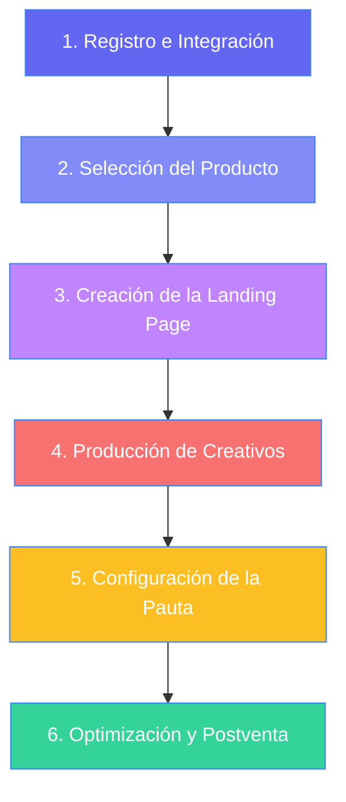

# RB-002 — Journey del Dropshipper: Desde Registro hasta Pauta Efectiva

---

## Metadatos

| Campo | Valor |
|---|---|
| **ID** | RB-002 |
| **Fecha de investigación** | 2026-06-23 |
| **Iniciativa relacionada** | Onboarding de Dropshippers, Herramientas para Vendors, Catálogo y Logística |
| **Segmento investigado** | Dropshippers latinoamericanos (Novatos, Intermedios y Avanzados) |
| **Etapa del journey** | Registro → Configuración → Selección → Creativos → Pauta → Postventa |
| **Fuente** | Consolidación de metodologías de dropshippers avanzados + Operaciones Dropi |
| **Tipo de fuente** | Metodología y Playbook de Proceso |
| **Nivel de confianza** | **Alto** — Construido sobre el flujo técnico real de la plataforma e insights cualitativos de vendedores escala (RB-001) |
| **Tags** | journey, registro, integraciones, catálogo, creativos, facebook-ads, tiktok-ads, landing-page, contraentrega, postventa |

---

## Problema de Journey
Muchos dropshippers que se registran en Dropi abandonan la plataforma antes de realizar su primera venta. Esto ocurre porque la brecha entre registrarse en un software y aprender a estructurar una pauta publicitaria rentable en redes sociales es gigantesca. El usuario novato suele fallar en la selección de productos con margen real, la coherencia de su embudo o el manejo de políticas de anuncios, lo que provoca la pérdida rápida de su presupuesto de testeo y frustración temprana.

---

## El Proceso de 6 Pasos del Dropshipper Exitoso

El siguiente diagrama detalla la ruta crítica de un dropshipper desde el registro hasta la venta escalada:



---

### Paso 1: Registro e Integración Tecnológica (El Cimiento)

El objetivo de esta fase es dejar el entorno técnico listo para que los pedidos viajen solos de la tienda a la transportadora sin intervención manual.

1. **Creación de cuenta en Dropi**:
   - Registro en la plataforma seleccionando el país de operación (ej. Colombia, México, Ecuador).
   - Verificación de datos de identidad y configuración de la **Billetera Dropi (Wallet)**.
   - *Nota de Wallet:* El dropshipper debe contar con un saldo mínimo inicial para respaldar los fletes de devolución en caso de que los clientes rechacen el producto en puerta.
2. **Integración con la plataforma de e-commerce**:
   - Conexión vía API de la tienda (generalmente Shopify, WooCommerce, o embudos en Funnelish).
   - Mapeo de estados de pedido: Configurar qué estado en Shopify (ej. *Paid* o *Unfulfilled*) dispara la creación automática del pedido en Dropi en estado "Creado" o "Por Enviar".
3. **Instalación de píxeles de seguimiento**:
   - Configuración del Píxel de Meta (Facebook) o TikTok en la tienda para rastrear eventos críticos: `PageView` (visita), `InitiateCheckout` (iniciar pago) y `Purchase` (compra).

---

### Paso 2: Selección del Producto Ganador (Búsqueda y Validación)

La diferencia entre el dropshipper novato y el avanzado radica en cómo seleccionan lo que van a vender.

| Criterio | Práctica Novata (Fracaso Común) | Metodología Avanzada (Éxito) |
|---|---|---|
| **Origen** | Copiar lo primero que ve en la Biblioteca de Anuncios. | Investigar problemas recurrentes del cliente (Amazon Reviews, Foros). |
| **Matemática (Márgenes)**| Multiplica el costo del producto por 1.5 o 2. | Regla del **3x o 4x**: El precio de venta debe cubrir Producto + Flete + Publicidad + Margen. |
| **Stock** | Empieza a testear productos sin mirar si el proveedor tiene unidades. | Exige stock verificado (mín. 100-200 unidades) o solicita privatización parcial. |
| **Calidad de Ficha** | Trabaja con fichas vacías e imágenes pixeladas. | Utiliza IA para mejorar imágenes (Nano Banana, Gemini) y busca videos limpios del producto. |

#### Variables clave en la selección:
- **Efecto WOW + Solución de Dolor**: El producto debe captar la atención de inmediato en el feed de redes sociales y resolver un dolor específico (salud, ahorro de tiempo, seguridad, estética).
- **Márgenes Saludables para Contra Entrega (COD)**:
  - *Costo del producto:* $15,000 COP
  - *Flete promedio nacional:* $14,000 COP
  - *Costo publicitario estimado (CPA objetivo):* $15,000 COP
  - *Precio mínimo de venta:* $69,000 - $79,000 COP (lo que deja un margen de ganancia neto de $25,000 - $35,000 COP para absorber cancelaciones y devoluciones).

---

### Paso 3: Definición del Ángulo de Venta y Creación de la Landing Page

Una vez elegido el producto, se debe definir **cómo** se va a presentar al cliente.

1. **Definir el Ángulo de Venta**:
   - No se vende el producto por sus características físicas, sino por la transformación que ofrece.
   - *Ejemplo (Depiladora Láser):*
     - *Ángulo A (Estético/Seguridad):* Piel suave sin vellos enterrados para las vacaciones.
     - *Ángulo B (Ahorro/Financiero):* Ahorra miles de dólares en costosos tratamientos en clínicas estéticas.
2. **Construir el Embudo (Landing Page)**:
   - **Coherencia Absoluta**: El título principal de la landing debe concordar con la promesa del anuncio publicitario. Si el anuncio habla de "ahorrar dinero", la landing no debe enfocarse únicamente en "rapidez".
   - **Estructura AIDA**:
     - *Atención:* Título impactante + Imagen o GIF de alta calidad.
     - *Interés:* Presentación detallada del problema que tiene el cliente.
     - *Deseo:* Demostración del producto resolviéndolo (GIFs de uso, testimonios locales, garantías).
     - *Acción:* Formulario de compra súper simplificado (Nombre, Celular, Dirección, Ciudad) enfocado en **Envío Gratis + Pago Contra Entrega**.
3. **Velocidad de Carga**: La landing page debe cargar en menos de 2.5 segundos (mínimo 85% de score móvil) para evitar la pérdida de clics publicitarios.

---

### Paso 4: Producción de Creativos Publicitarios (UGC & IA)

El creativo publicitario (video o imagen) es la puerta de entrada. Si el creativo falla, la pauta es costosa y la campaña muere.

#### Anatomía de un Video Creativo Ganador (15 a 30 segundos)
```
[ 0-3 seg: HOOK ]       --> Captura la atención (Dolor, curiosidad o situación absurda).
  [ 3-15 seg: CUERPO ]    --> Presenta el producto en acción, demostrando la transformación.
    [ 15-20 seg: PRUEBA ]   --> Testimonial rápido, acercamiento (UGC) o beneficio único.
      [ 20-30 seg: CTA ]      --> Llamado a la acción claro ("Compra hoy y paga al recibir").
```

#### Herramientas recomendadas para la producción:
- **Inspiración**: Foreplay, Minea, Biblioteca de Anuncios de Meta.
- **Edición rápida**: CapCut (añadir subtítulos dinámicos de colores, música viral y locuciones con IA).
- **IA Generativa**:
  - *Imágenes:* Freepik, Gemini para mejorar fondos de productos Dropi con baja iluminación.
  - *Voces y Avatares:* HeyGen o VO3 para generar voces naturales sin necesidad de contratar locutores.
  - *UGC (User Generated Content):* Plataformas como Monono para coordinar creadores reales que graben videos sosteniendo el producto.

---

### Paso 5: Configuración y Lanzamiento de la Pauta (Pauta Efectiva)

Aquí es donde se invierte el presupuesto en las plataformas de anuncios (generalmente Facebook Ads o TikTok Ads).

#### Estructura Estándar de Campaña de Testeo (Método CBO/ABO)
- **Campañas**: Enfoque de Conversiones (evento de conversión: **Compra** o **Purchase**).
- **Segmentación**:
  - 1 Conjunto de anuncios con **Segmentación Abierta** (sin intereses, solo demografía: Edad 25-55, país de operación). Esto permite que el algoritmo inteligente de Meta busque al comprador.
  - 2 o 3 Conjuntos de anuncios con **Intereses Amplios** relacionados al nicho (ej. para belleza: "cuidado personal", "cosméticos").
- **Presupuesto de Testeo**:
  - Asignar presupuesto equivalente a **1 o 1.5 veces el CPA objetivo** por cada conjunto de anuncios al día.
  - *Ejemplo:* Si el CPA máximo permitido es $15,000 COP, el conjunto debe tener mínimo $15,000 a $22,500 COP diarios.
- **Anuncios por Conjunto**: Insertar de **2 a 3 variaciones de creativos** (diferentes hooks o formatos) para dejar que el sistema determine cuál funciona mejor.

#### Mitigación de Dolores Operativos (Contingencias contra baneos)
- Debido a los baneos constantes por políticas de privacidad o nichos delicados (salud/belleza), los dropshippers avanzados usan **granjas de perfiles** gestionados con navegadores multilogin (como *Power*) y proxies residenciales para tener cuentas publicitarias de respaldo.

---

### Paso 6: Optimización, Métricas y Operación Postventa (La Escala)

El negocio del dropshipping no termina al conseguir la venta en redes; concluye cuando el cliente final recibe el producto y la transportadora le entrega el dinero a Dropi.

#### 1. Métricas de Pauta y Toma de Decisiones (Killing Rules)

| Métrica | Definición | Nivel Saludable | Acción si está por debajo |
|---|---|---|---|
| **CTR (Click-Through Rate)** | % que da clic al anuncio. | > 1.8% | Cambiar el Hook o el Creativo por completo. |
| **Hook Rate** | % que ve los primeros 3 segundos. | > 30% | El inicio del video no engancha; cambiar los primeros 3s. |
| **CPA (Costo por Adquisición)** | Costo de cada orden generada. | < CPA Objetivo | Si el CPA supera 1.5x el objetivo, **apagar** el conjunto. |
| **Pagos Iniciados / Compras** | Relación de intención vs compra final.| > 60% | Si la relación es baja, el formulario o la oferta de la landing confunden. |

#### 2. Operación de Postventa (Garantía de Entrega)
En América Latina, el dropshipping funciona en un 80% bajo el modelo de **Pago Contra Entrega (COD)**. Esto introduce el riesgo de la devolución (el cliente se arrepiente, no está en casa, o no tiene el dinero al momento de la entrega).

- **Confirmación de Pedidos**: Antes de despachar, se debe contactar al cliente por WhatsApp (usando herramientas como *Chatéa Pro*) para validar: dirección exacta, datos de contacto y confirmar que estará disponible para pagar. **Esto reduce la tasa de devolución del 25% al 10-15%**.
- **Gestión de Novedades**: Monitorear diariamente en el panel de Dropi los pedidos en estado "Novedad" (ej. dirección no encontrada, cliente ausente) para reprogramar la entrega de inmediato con la transportadora.

---

## Recomendaciones para el Agente de Research

Al guiar a un dropshipper o evaluar su comportamiento (dentro del pipeline de `dropi-researcher`):
1. **Identificar la Falla Raíz**: Si el usuario reporta pérdidas, validar la coherencia métrica. Un CTR alto con cero ventas apunta a una landing lenta o mal redactada (fricción de conversión), mientras que un CTR bajo apunta a un mal creativo.
2. **Alertar sobre Gastos Ocultos**: Asegurarse de que el dropshipper use un CPA que considere la tasa de devolución histórica (típicamente del 15% al 20% en envíos nacionales de contra entrega).
3. **Fomentar la Privatización**: Recomendar a dropshippers en fase de crecimiento negociar inventario privado con los suppliers en Dropi para evitar la guerra de precios y asegurar consistencia de stock.
